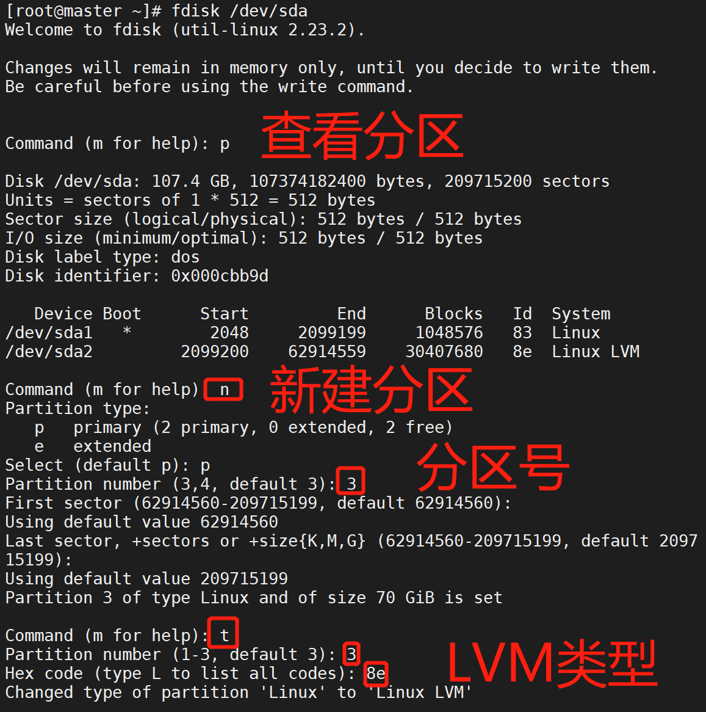

### 磁盘扩容

> 1.编辑虚拟机调整硬盘空间，重启虚拟机


> 2.查看分区后扩容后的大小

```shell
fdisk -l
```
    


已经扩到了`100G`（扩容前30G）

> 3.新建分区并设置分区为LVM格式

```shell
fdisk /dev/sda
```
    


最后键入w写入


> 4.创建物理卷，并加入到卷组

```shell
partprobe
pvcreate /dev/sda3
```
    

    
扩展vg卷组大小

```shell
vgs
vgextend /dev/centos /dev/sda3
vgs
```


> 5.使用`lvextend`命令来扩容`lv`逻辑卷空间大小

```shell
lvs
lvextend -L +69.9G /dev/centos/root
```
    


查看文件系统

```shell
df -lhT
```


    
重新加载逻辑卷的大小

- `xfs`类型文件系统执行

```shell
xfs_growfs /dev/centos/root
```
    
- `ext2、ext3、ext4`类型文件系统执行

```shell
resize2fs /dev/centos/root
```
    
> 6.查看磁盘大小

```shell
df -h
```
    


    