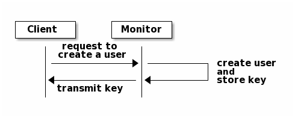
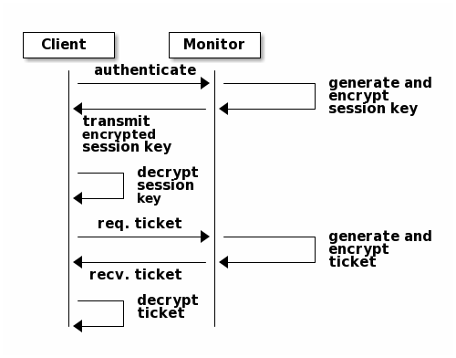
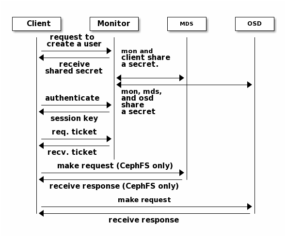
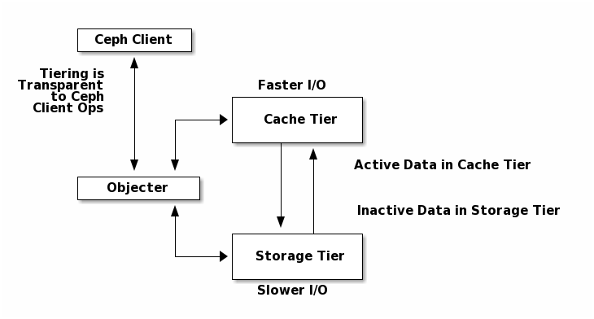

## `Ceph`的可伸缩性和高可用性

在传统的架构中，客户端与一个集中的组件(例如，网关、代理、API、facade等)通信，该组件充当一个进入复杂子系统的单一入口点。
这对性能和可伸缩性都施加了限制，同时引入了单点故障(例如，如果集中式组件宕机，整个系统也宕机）

`Ceph`消除了集中式网关，使客户端可以直接与`ceph osd`守护进程交互。`ceph osd`守护进程在其他`Ceph`节点上创建对象副本，以确保数据的安全性和高可用性。
`Ceph`还使用一组`mon`来确保高可用性。为了消除集中化，`Ceph`使用了一种称为`CRUSH`的算法

### `mon`高可用

在`Ceph`客户机能够读写数据之前，它们必须访问`Ceph mon`以获取集群映射的最新副本。`Ceph`存储集群可以使用单个`mon`进行操作;然而，这引入了单点故障(即，如果监视器出现故障，Ceph客户机就无法读写数据)。

为了增加可靠性和容错性，`Ceph`支持`mon`集群。在一个监视器集群中，延迟和其他故障可能导致一个或多个监视器落后于集群的当前状态。由于这个原因，`Ceph`必须在关于集群状态的各个监视器实例之间达成一致。`Ceph`总是使用大多数监视器(例如，1、2:3、3:5、4:6等)和`Paxos`算法来在监视器之间建立关于集群当前状态的共识

**即部署多点ceph mon 规避单点故障**

> 身份认证高可用性

为了识别用户并防止中间人攻击，`Ceph`提供了`cephx`身份验证系统来验证用户和守护进程。（`cephx`协议不处理传输中的数据加密(例如，`SSL/TLS`)或静止时的加密。）

`Cephx`使用共享密钥进行身份验证，这意味着客户端和监控集群都拥有客户端密钥的副本。身份验证协议是这样的，双方能够向对方证明他们有一个密钥的副本，而不实际暴露它。这提供了相互的身份验证，这意味着集群确定用户拥有密钥，用户也确定集群拥有密钥的副本

`Ceph`的一个关键的可伸缩性特性是避免对`Ceph`对象存储的集中接口，这意味着`Ceph`客户端必须能够直接与`OSD`交互。为了保护数据，`Ceph`提供了其`cephx`身份验证系统，该系统对操作`Ceph`客户端的用户进行身份验证。`cephx`协议的操作方式与`Kerberos`类似

要使用`cephx`，管理员必须首先设置用户。在下面的图表中`client.admin`从命令行调用`ceph auth get-or-create-key`来生成用户名和密钥。
`Ceph`的`auth`子系统生成用户名和密钥，将一个副本存储在监视器中，并将用户的密钥传输回`client.admin`。
这意味着客户端和监视器共享一个密钥来使用`cephx`.

为了使用监视器进行身份验证，客户端将用户名传递给监视器，监视器生成一个会话密钥并使用与用户名相关联的密钥对其进行加密。
然后，监视器将加密的票据传输回客户端。随后，客户机使用共享密钥解密，以检索会话密钥。会话密钥标识当前会话的用户。
然后客户端使用会话密钥签名的用户请求票据。监视器生成一个票据，用用户的密钥对其加密，并将其传回客户机。
客户端解密票据，并使用它对整个集群中的`OSDs`和元数据服务器的请求进行签名

`cephx`协议对客户端机器和`Ceph`服务器之间的通信进行身份验证。
在初始身份验证之后，客户机和服务器之间发送的每个消息都使用票据进行签名，
监视器、OSD和元数据服务器可以使用它们的共享秘密来验证该票据

这种身份验证提供的保护在`Ceph`客户端和`Ceph`服务器主机之间。身份验证没有扩展到`Ceph`客户端之外。
如果用户从远程主机访问`Ceph`客户端，`Ceph`身份验证不应用于用户的主机和客户端主机之间的连接

### 分级缓存

缓存层为`Ceph`客户端提供了更好的`I/O`性能，用于存储在备份存储层中的数据子集。
分级缓存包括创建一个作为缓存层的相对快速/昂贵的存储设备(例如，固态驱动器)池，以及一个配置为纠错码或相对较慢/便宜的设备作为经济存储层的后备池。
`Ceph objecter`处理放置对象的位置，而分层代理确定何时将对象从缓存刷新到后备存储层。因此，缓存层和后备存储层对`Ceph`客户端是完全透明的

