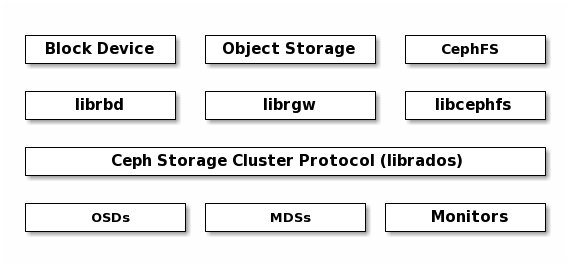
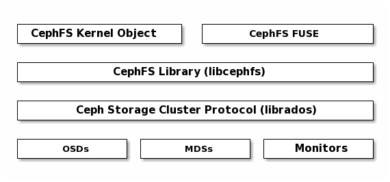

## Ceph存储类型

`Ceph`客户端包括许多服务接口:

- 块设备：`Ceph`块设备(又称RBD)服务提供可调整大小、精简配置的块设备，并提供快照和克隆。`Ceph`跨集群划分块设备以获得高性能。`Ceph`既支持内核对象(KO)，也支持直接使用`librbd`的`QEMU`管理程序——避免了虚拟化系统的内核对象开销

- 对象存储：`Ceph`对象存储服务(简称RGW)提供`RESTful api`，兼容`Amazon S3`和`OpenStack Swift`接口

- 文件系统：`Ceph`文件系统(cepphfs)服务提供一个兼容`POSIX`的文件系统，可以挂载，也可以作为用户空间中的文件系统(FUSE)使用。

### 1.Ceph块存储

块是字节序列（例如，512字节的数据块）。基于块的存储接口是使用旋转介质（如硬盘、CD、软盘，甚至传统的9磁道磁带）存储数据的最常用方法。
块设备接口的普遍性使得虚拟块设备成为与`Ceph`这样的海量数据存储系统交互的理想候选设备

`Ceph`块设备是精简配置的，可调整大小，并在`Ceph`集群中的多个`OSD`上存储数据条带化。
`Ceph`块设备利用`RADOS`功能，如快照、复制和一致性。
`Ceph`的`RADOS`块设备（RBD）使用内核模块或`librbd`库与`OSD`交互

`Ceph`的`block`设备以无限的可扩展性向内核模块或`kvm`（如QEMU）以及为基于云的计算系统（如OpenStack和CloudStack）提供高性能存储，
这些系统依赖`libvirt`和`QEMU`与`Ceph block`设备集成。您可以使用同一集群同时操作`Ceph-RADOS`网关、`CephFS`文件系统和`Ceph-block`设备。

`Ceph`块设备在`Ceph`存储集群中的多个对象上划分块设备映像，每个对象映射到一个放置组并分布，放置组分布在整个集群中不同的`ceph osd`守护进程上。

精简配置的可快照`Ceph`块设备是虚拟化和云计算的一个有吸引力的选择。
在虚拟机场景中，人们通常在`QEMU/KVM`中部署带有`rbd`网络存储驱动程序的`Ceph`块设备，其中服务端使用`librbd`向客户端提供块设备服务。
许多云计算栈使用`libvirt`与管理程序集成。您可以通过`QEMU`和`libvirt`使用瘦配置的`Ceph`块设备来支持`OpenStack`和`CloudStack`以及其他解决方案。

### 2.Ceph文件系统

`Ceph`文件系统(cepphfs)提供了`posix`兼容的文件系统作为一种服务，它是在基于对象的`Ceph`存储集群之上分层的。
`cepfs`文件映射到`Ceph`存储集群中存储的对象。`Ceph`客户端将`cepfs`文件系统挂载为内核对象或用户空间中的文件系统(FUSE)

`Ceph`文件系统服务包括部署在`Ceph`存储集群中的`Ceph`元数据服务器(MDS)。
`MDS`的目的是将所有文件系统元数据(目录、文件所有权、访问模式等)存储在高可用性`Ceph`元数据服务器中，元数据驻留在内存中。
`MDS`(称为Ceph - MDS的守护进程)存在的原因是，简单的文件系统操作，如列出目录或更改目录(ls、cd)，会给`ceph osd`守护进程带来不必要的负担。
因此，将元数据从数据中分离出来意味着`Ceph`文件系统可以提供高性能服务，而不会对`Ceph`存储集群造成负担。

`cepfs`将元数据与数据进行分离，元数据存储在`MDS`中，文件数据存储在`Ceph`存储集群中的一个或多个对象中。
`Ceph`文件系统旨在与`POSIX`兼容。为了实现高可用性或可伸缩性，`ceph-mds`可以作为单个进程运行，也可以将其分发到多个物理机器。

- 高可用：额外的`ceph-mds`实例可以是备用的，随时准备接管任何失效的`active ceph-mds`的职责。这很容易，因为包括日志在内的所有数据都存储在`RADOS`上。该转换由`ceph-mon`自动触发
- 可扩展：多个`ceph mds`实例可以处于活动状态，它们将目录树拆分为子树（以及单个繁忙目录的碎片），从而有效地平衡所有活动服务器之间的负载

### 3.Ceph 对象存储

`Ceph`对象存储守护进程`radosgw`是一个`FastCGI`服务，它提供了一个`RESTful`的`HTTP API`来存储对象和元数据。
它以自己的数据格式在`Ceph`存储集群之上分层，并维护自己的用户数据库、身份验证和访问控制。
`RADOS`网关采用统一的命名空间，既可以使用`OpenStack swift`接口，也可以使用`Amazon s3`接口。
例如，一个应用使用`s3`兼容的`API`写入数据，另一个应用使用`swift`兼容的`API`读取数据

**S3/Swift对象和存储集群对象对比：**

`Ceph`的`Object Storage`使用`Object`这个术语来描述它存储的数据。
`S3`和`Swift`对象与`Ceph`写入`Ceph`存储集群的对象不同。
`Ceph`对象存储对象映射到`Ceph`存储集群对象。
`S3`和`Swift`对象不一定与存储集群中存储的对象以1:1的方式对应。
`S3`或`Swift`对象有可能映射到多个`Ceph`对象。