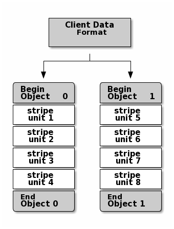

### 数据分段

存储设备有吞吐量限制，这会影响性能和可伸缩性。因此，存储系统通常支持跨多个存储设备分段存储顺序信息，以提高吞吐量和性能。
`RAID`是最常见的数据分条形式。与`Ceph`的条带化最相似的`RAID`类型是`raid0`，或“条带卷”。`Ceph`的分条提供了`RAID 0`分条的吞吐量，`n-way RAID`镜像的可靠性和更快的恢复。

`Ceph`存储集群中`Ceph`存储的对象没有条带化。`Ceph`对象存储、`Ceph`块设备和`Ceph`文件系统在多个`Ceph`存储集群对象上条带化它们的数据。
通过`librados`直接写入`Ceph`存储集群的`Ceph`客户端必须为自己执行条带化（和并行I/O）以获得这些好处。

最简单的`Ceph`条带格式涉及1个对象的条带计数。`Ceph`客户端将条带单元写入`Ceph`存储群集对象，直到该对象达到最大容量，然后为额外的数据条带创建另一个对象。
最简单的条带化形式对于小块设备图像、`S3`或`Swift`对象和`cepfs`文件就足够了。
然而，这种简单的形式并没有最大限度地利用`Ceph`在放置组之间分发数据的能力，因此并没有极大地提高性能。下图描述了条带化的最简单形式：

如果预期会有较大的镜像、较大的`S3`或`Swift`对象（例如，视频）或较大的`cepfs`目录，那么通过在对象集中的多个对象上对客户端数据进行条带化，会有相当大的读/写性能改进。
当客户端并行地将条带单元写入相应的对象时，会显著提升写入性能。由于对象被映射到不同的放置组并进一步映射到不同的`OSD`，因此每次写入都以最大的写入速度并行进行。
对单个磁盘的写入将受到磁头移动（例如，每次寻道6ms）和该设备带宽（例如，100MB/s）的限制。
通过将写操作扩展到多个对象（映射到不同的放置组和OSD），`Ceph`可以减少每个驱动器的寻道次数，并结合多个驱动器的吞吐量，以实现更快的写（或读）速度。

在下面的图中，客户端数据在由4个对象组成的对象集(下图中的对象集1)上进行分条，
其中第一个分条单元是对象0中的分条单元0，第四个分条单元是对象3中的分条单元3。
写入第四个分条后，客户端确定对象集是否已满。
如果对象集未满，客户端将开始再次向第一个对象(下图中的对象0)写入条带。
如果对象集已满，客户端将创建一个新的对象集(下图中的对象集2)，
并开始写入新对象集(下图中的对象4)中的第一个对象中的第一个条带(条带单元16)。

决定`Ceph`条带化数据的方式的三个重要变量:

- 对象大小：`Ceph`存储集群中的对象具有最大可配置大小（例如，2MB、4MB等）。对象大小应该足够大以容纳多个条带单位，并且应该是条带单位的倍数
- 条带宽度：条带具有可配置的单元大小（例如64kb）。`Ceph`客户端将要写入对象的数据划分为大小相等的条带单元，但最后一个条带单元除外。条带宽度应该是对象大小的一小部分，这样一个对象可以包含许多条纹单位。
- 条带计数：`Ceph`客户端在由条带计数确定的一系列对象上写入条带单元序列。这一系列对象被称为对象集。`Ceph`客户端写入对象集中的最后一个对象后，它返回到对象集中的第一个对象

一旦`Ceph`客户端将数据分条到条带单元并将条带单元映射到对象，`Ceph`的`CRUSH`算法将对象映射到放置组，并将放置组映射到`ceph osd`守护进程，然后将对象作为文件存储在存储磁盘上
