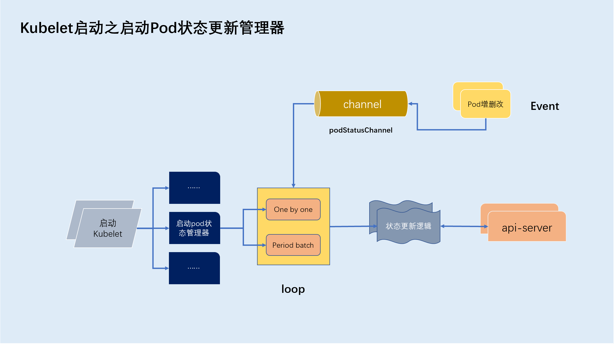
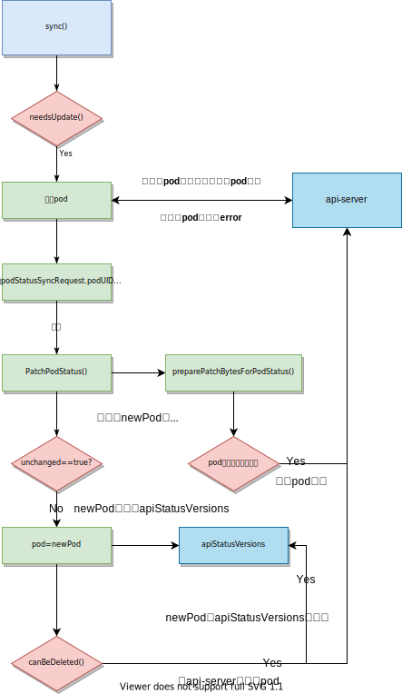

# 启动pod状态管理器

基于`kubernetes v1.18.6`

## 概述

`pod`管理器主要用来将本地`pod`状态信息同步到`apiserver`，`statusManage`并不会主动监控`pod`的状态，而是提供接口供其他`manager`进行调用。
对于`pod`状态的变更会推入名为`podStatusChannel`的通道，`statusManage`在启动的时候会开辟一个`goroutine`，用于循环处理`podStatusChannel`内`pod`状态变更对象。

`statusManage`对`podStatusChannel`内对象的处理分为两种方式：

- 方式一: `sync()`。按顺序逐一处理`podStatusChannel`内对象，先进先出
- 方式二: `batch()`。每`10s`批量处理

两种方式同步进行



> 状态管理器数据结构

- `kubeClient`: 用于和`apiserver`交互，查询/更新`pod`状态
- `podManager`: 用于管理本地`pod`缓存信息（避免频繁与`apiserver`交互）
- `podStatuses`: 缓存本地`pod`状态，`map`类型，`key`为`pod`的`uid`，`value`为`pod`的`status`字段内容。
- `podStatusesLock`: 线程锁
- `podStatusChannel`: 存放`pod`状态变更事件`channel`，该通道为缓冲通道，缓冲`1000`个`podStatusSyncRequest`对象。
- `apiStatusVersions`: 维护最新的`pod status`版本号，每更新一次会加`1`
- `podDeletionSafety`: 安全删除`pod`的接口

```go
type manager struct {
	kubeClient clientset.Interface
	podManager kubepod.Manager
	// Map from pod UID to sync status of the corresponding pod.
	podStatuses      map[types.UID]versionedPodStatus
	podStatusesLock  sync.RWMutex
	podStatusChannel chan podStatusSyncRequest
	// Map from (mirror) pod UID to latest status version successfully sent to the API server.
	// apiStatusVersions must only be accessed from the sync thread.
	apiStatusVersions map[kubetypes.MirrorPodUID]uint64
	podDeletionSafety PodDeletionSafetyProvider
}
```

> 状态管理器初始化阶段

在初始化`kubelet`实例的时候初始化

```go
func NewMainKubelet(kubeCfg *kubeletconfiginternal.KubeletConfiguration,
kubeDeps *Dependencies,
crOptions *config.ContainerRuntimeOptions,
containerRuntime string,
hostnameOverride string,
nodeIP string,
providerID string,
cloudProvider string,
certDirectory string,
rootDirectory string,
registerNode bool,
registerWithTaints []api.Taint,
allowedUnsafeSysctls []string,
experimentalMounterPath string,
experimentalKernelMemcgNotification bool,
experimentalCheckNodeCapabilitiesBeforeMount bool,
experimentalNodeAllocatableIgnoreEvictionThreshold bool,
minimumGCAge metav1.Duration,
maxPerPodContainerCount int32,
maxContainerCount int32,
masterServiceNamespace string,
registerSchedulable bool,
keepTerminatedPodVolumes bool,
nodeLabels map[string]string,
seccompProfileRoot string,
bootstrapCheckpointPath string,
nodeStatusMaxImages int32) (*Kubelet, error) {
...
    klet.statusManager = status.NewManager(klet.kubeClient, klet.podManager, klet)
...
}
```

## sync()处理流程解析

当一个`pod`状态变更被推入`podStatusChannel`后，且未到达定时器设置时间（10s间隔），将交由`sync()`函数处理。

首先我们了解下`podStatusChannel`存放的对象数据结构：

- `podUID`: `pod`的`uid`
- `status`: `pod`状态变更对象
```go
type podStatusSyncRequest struct {
	podUID types.UID
	status versionedPodStatus
}
```

- `status`: `pod`的`status`字段(可通过`kubectl get pod <pod-name> -n <pod-namespace> -o yaml`查看)
- `version`: `pod`状态变更版本计数，每变更一次对应加一。
- `podName`: `pod`名称
- `podNamespace`: `pod`所属命名空间

```go
type versionedPodStatus struct {
	status v1.PodStatus
	// Monotonically increasing version number (per pod).
	version uint64
	// Pod name & namespace, for sending updates to API server.
	podName      string
	podNamespace string
}
```

接下来我们来分析下处理流程:

1. 判断`pod`是否需要更新。判断方式如下（顺序执行判断逻辑）:
- 根据`pod uid`从`apiStatusVersions`获取`pod`实例，若获取失败（如：第一次创建时并没有存储`pod`状态信息）则需要更新
- 根据`pod uid`从`apiStatusVersions`获取`pod`实例，若获取的`pod`状态版本（`statusManager.apiStatusVersions[<pod uid>]`）小于`podStatusSyncRequest`对象的`status.version`版本，则需要更新
- 根据`pod uid`从`podManager`获取`pod`实例，若获取失败（如已经被删除）则不需要更新
- 上述情况均不满足会调用`canBeDeleted()`函数。`canBeDeleted()`函数判断如下：
    - `pod`不存在`DeletionTimestamp`字段或`pod`类型为镜像类型`pod`，不需要更新
    - 上述情况均不满足，说明`pod`处于删除状态。调用`PodResourcesAreReclaimed()`函数，判断是否可以安全删除，返回`PodResourcesAreReclaimed()`函数返回值

`PodResourcesAreReclaimed()`函数判断以下状态的`pod`是否已被安全删除（`pod`可能处于删除中状态，但未删除完毕）: 
- `pod`处于`terminated`状态，但仍有`container`处于`running`状态，返回`false`
- `pod`处于`terminated`状态，但无法从`podCache`缓存对象中获取运行时信息，返回`false`
- `pod`处于`terminated`状态，但仍有`container`未被清理完毕，返回`false`
- `pod`处于`terminated`状态，但仍有卷未被清理完毕，返回`false`
- `pod`处于`terminated`状态，但`pod cgroup`沙盒未被清理完毕，返回`false`

2. 从`apiserver`获取`pod`实例（入参命名空间、`pod`名称），若获取不到（可能已被删除），说明不需要同步`Pod`状态，跳出对当前`pod`处理流程。
3. 对比`podStatusSyncRequest.podUID`与从`apiserver`查询到的`pod uid`是否相同，如不相同说明`pod`可能被删除重建，则不需要同步`Pod`状态，跳出对当前`pod`处理流程。
4. 调用`apiserver`同步`pod`最新的`status`。同步之前比对`oldPodStatus`与`newPodStatus`差异，若存在差异调用`api-server`对`pod`状态进行更新，并将返回的`pod`作为`newPod`，如不存在差异将不会调用`api-server`进行更新。其中
- `oldPodStatus`: 根据`pod`归属命名空间、`pod`名称从`apiserver`查询到的`pod`实例的`status`值
- `newPodStatus`: 从`podStatusChannel`通道传递来的需要更新状态的`pod`实例的`status`值。
5. 调用`canBeDeleted()`函数（删除`pod`事件触发的修改`pod`状态会走该逻辑）。`canBeDeleted()`函数判断如下：
  - `newPod`不存在`DeletionTimestamp`字段或`newPod`类型为镜像类型`pod`，返回`false`
  - 上述情况均不满足，说明`newPod`处于删除状态。调用`PodResourcesAreReclaimed()`函数，判断是否可以安全删除，返回`PodResourcesAreReclaimed()`函数返回值

`PodResourcesAreReclaimed()`函数判断以下状态的`newPod`是否已被安全删除（`pod`可能处于删除中状态，但未删除完毕）:
- `newPod`处于`terminated`状态，但仍有`container`处于`running`状态，返回`false`
- `newPod`处于`terminated`状态，但无法从`podCache`缓存对象中获取运行时信息，返回`false`
- `newPod`处于`terminated`状态，但仍有`container`未被清理完毕，返回`false`
- `newPod`处于`terminated`状态，但仍有卷未被清理完毕，返回`false`
- `newPod`处于`terminated`状态，但`pod cgroup`沙盒未被清理完毕，返回`false`

当`newPod`可以被安全删除，调用`apiserver`对`newPod`执行删除操作，删除成功后将`newPod`从`statusManager.podStatuses`（该对象缓存`pod`状态信息）中删除



> 核心源码

```go
func (m *manager) syncPod(uid types.UID, status versionedPodStatus) {
	if !m.needsUpdate(uid, status) {
		klog.V(1).Infof("Status for pod %q is up-to-date; skipping", uid)
		return
	}

	// TODO: make me easier to express from client code
	pod, err := m.kubeClient.CoreV1().Pods(status.podNamespace).Get(context.TODO(), status.podName, metav1.GetOptions{})
	if errors.IsNotFound(err) {
		klog.V(3).Infof("Pod %q does not exist on the server", format.PodDesc(status.podName, status.podNamespace, uid))
		// If the Pod is deleted the status will be cleared in
		// RemoveOrphanedStatuses, so we just ignore the update here.
		return
	}
	if err != nil {
		klog.Warningf("Failed to get status for pod %q: %v", format.PodDesc(status.podName, status.podNamespace, uid), err)
		return
	}

	// 获取pod真实uid（针对static类型pod的uid需要做转换）
	translatedUID := m.podManager.TranslatePodUID(pod.UID)
	// Type convert original uid just for the purpose of comparison.
	if len(translatedUID) > 0 && translatedUID != kubetypes.ResolvedPodUID(uid) {
		klog.V(2).Infof("Pod %q was deleted and then recreated, skipping status update; old UID %q, new UID %q", format.Pod(pod), uid, translatedUID)
		m.deletePodStatus(uid)
		return
	}

	oldStatus := pod.Status.DeepCopy()
	newPod, patchBytes, unchanged, err := statusutil.PatchPodStatus(m.kubeClient, pod.Namespace, pod.Name, pod.UID, *oldStatus, mergePodStatus(*oldStatus, status.status))
	klog.V(3).Infof("Patch status for pod %q with %q", format.Pod(pod), patchBytes)
	if err != nil {
		klog.Warningf("Failed to update status for pod %q: %v", format.Pod(pod), err)
		return
	}
	if unchanged {
		klog.V(3).Infof("Status for pod %q is up-to-date: (%d)", format.Pod(pod), status.version)
	} else {
		klog.V(3).Infof("Status for pod %q updated successfully: (%d, %+v)", format.Pod(pod), status.version, status.status)
		pod = newPod
	}

	m.apiStatusVersions[kubetypes.MirrorPodUID(pod.UID)] = status.version

	// We don't handle graceful deletion of mirror pods.
	if m.canBeDeleted(pod, status.status) {
		deleteOptions := metav1.DeleteOptions{
			GracePeriodSeconds: new(int64),
			// Use the pod UID as the precondition for deletion to prevent deleting a
			// newly created pod with the same name and namespace.
			Preconditions: metav1.NewUIDPreconditions(string(pod.UID)),
		}
		err = m.kubeClient.CoreV1().Pods(pod.Namespace).Delete(context.TODO(), pod.Name, deleteOptions)
		if err != nil {
			klog.Warningf("Failed to delete status for pod %q: %v", format.Pod(pod), err)
			return
		}
		klog.V(3).Infof("Pod %q fully terminated and removed from etcd", format.Pod(pod))
		m.deletePodStatus(uid)
	}
}
```

## syncBatch()处理流程解析

`syncBatch()`主要是将`statusManager.podStatuses`中的数据与`statusManager.apiStatusVersions`和`statusManager.podManager`中的数据进行对比是否一致，若不一致则以`statusManager.podStatuses`中的数据为准同步至`apiserver`。


- `statusManager.podStatuses`
- `statusManager.podManager`
- `statusManager.apiStatusVersions`: 维护最新的`pod status`版本号，`map`类型集合，`key`为`pod uid`，`value`为`pod status`
