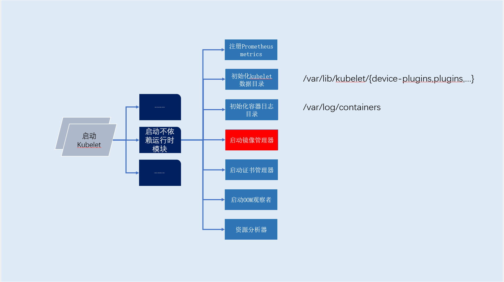

# 启动镜像管理器

基于`kubernetes v1.18.6`

## 概述

镜像管理器包含运行时相关接口，拥有对镜像、`pod`操作的能力。

主要功能如下：
- 协助`gc`管理器对镜像垃圾回收（提供镜像列表）
- 协助节点状态管理器记录当前节点镜像（`imageCache`）

> 镜像管理器数据结构

```go
type realImageGCManager struct {
	// Container runtime
	runtime container.Runtime

	// Records of images and their use.
	imageRecords     map[string]*imageRecord
	imageRecordsLock sync.Mutex

	// The image garbage collection policy in use.
	policy ImageGCPolicy

	// statsProvider provides stats used during image garbage collection.
	statsProvider StatsProvider

	// Recorder for Kubernetes events.
	recorder record.EventRecorder

	// Reference to this node.
	nodeRef *v1.ObjectReference

	// Track initialization
	initialized bool

	// imageCache is the cache of latest image list.
	imageCache imageCache

	// sandbox image exempted from GC
	sandboxImage string
}
```

## 工作流程解析

镜像管理器是一个`kubelet`子模块，在`kubelet`启动流程内启动。



> 工作流程解析

镜像管理器启动时会`fork`两个`goroutine`进行周期性调用，主要维护以下两个对象：

- `realImageGCManager.imageRecords`: 记录镜像列表，以及镜像是否处于被使用状态。（五分钟更新一次，作为`GC`时清理镜像的依据）
- `realImageGCManager.imageCache`: 用于记录节点状态（镜像列表缓存，三十秒更新一次。避免频繁调用运行时获取）

显然这两个`goroutine`是可以合并的，源码确实也加了`todo`标识（`// TODO(random-liu): Merge this with the previous loop.`）

> imageRecords对象解析

`imageRecords`是一个`map`类型对象，`key`为镜像`id`，`value`为`imageRecord`对象。

`imageRecord`对象记录了镜像的状态，包含`GC`所需要的信息：

- `firstDetected`: 记录镜像被检测时间
- `lastUsed`: 记录镜像上次被使用时间
- `size`: 镜像大小

> `imageCache`对象解析

`imageCache`是一个线程安全的对象，`images`是一个按镜像大小降序的镜像列表切片。

```go
type imageCache struct {
// sync.Mutex is the mutex protects the image cache.
sync.Mutex
// images is the image cache.
images []container.Image
}
```

> 源码实现

```go
func (im *realImageGCManager) Start() {

	// 每5分钟执行：
	//
	go wait.Until(func() {
		// Initial detection make detected time "unknown" in the past.
		var ts time.Time
		if im.initialized {
			ts = time.Now()
		}
		// 仅为了测试是否可以监控到节点镜像
		_, err := im.detectImages(ts)
		if err != nil {
			klog.Warningf("[imageGCManager] Failed to monitor images: %v", err)
		} else {
			im.initialized = true
		}
	}, 5*time.Minute, wait.NeverStop)

	// Start a goroutine periodically updates image cache.
	// TODO(random-liu): Merge this with the previous loop.
	go wait.Until(func() {
		images, err := im.runtime.ListImages()
		if err != nil {
			klog.Warningf("[imageGCManager] Failed to update image list: %v", err)
		} else {
			im.imageCache.set(images)
		}
	}, 30*time.Second, wait.NeverStop)

}
```