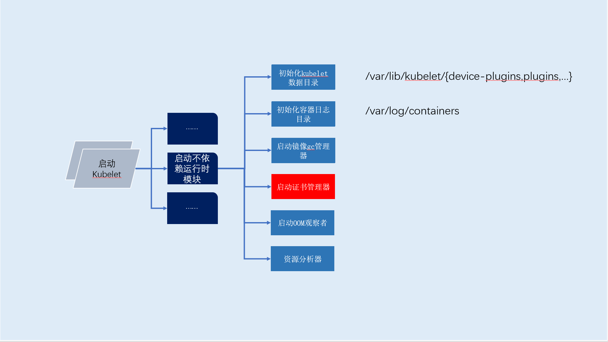

# 启动证书管理器

## 概述

启动阶段如下图（红色部分）



> 证书管理器是做什么的？

当证书到期时，通过向`kube-apiserver`请求新证书，自动[轮转kubelet客户端证书](https://kubernetes.io/zh/docs/tasks/tls/certificate-rotation/) 。

> 关联启动配置/标识

建议通过配置文件（一般为：`/var/lib/kubelet/config.yaml`）添加`rotateCertificates: true`项开启

> `kubelet`证书目录（`--cert-dir`指定）

```
$ pwd 
/var/lib/kubelet/pki
$ ls
kubelet-client-2021-08-23-16-32-25.pem  kubelet-client-current.pem  kubelet.crt  kubelet.key
```

## 解析

> 流程解析


> 源码实现

`kubernetes\vendor\k8s.io\client-go\util\certificate\certificate_manager.go`
```go
// Start will start the background work of rotating the certificates.
func (m *manager) Start() {
	// Certificate rotation depends on access to the API server certificate
	// signing API, so don't start the certificate manager if we don't have a
	// client.
	if m.clientFn == nil {
		klog.V(2).Infof("Certificate rotation is not enabled, no connection to the apiserver.")
		return
	}

	klog.V(2).Infof("Certificate rotation is enabled.")

	templateChanged := make(chan struct{})
	go wait.Until(func() {
		deadline := m.nextRotationDeadline()
		if sleepInterval := deadline.Sub(m.now()); sleepInterval > 0 {
			klog.V(2).Infof("Waiting %v for next certificate rotation", sleepInterval)

			timer := time.NewTimer(sleepInterval)
			defer timer.Stop()

			select {
			case <-timer.C:
				// unblock when deadline expires
			case <-templateChanged:
				_, lastRequestTemplate := m.getLastRequest()
				if reflect.DeepEqual(lastRequestTemplate, m.getTemplate()) {
					// if the template now matches what we last requested, restart the rotation deadline loop
					return
				}
				klog.V(2).Infof("Certificate template changed, rotating")
			}
		}

		// Don't enter rotateCerts and trigger backoff if we don't even have a template to request yet
		if m.getTemplate() == nil {
			return
		}

		backoff := wait.Backoff{
			Duration: 2 * time.Second,
			Factor:   2,
			Jitter:   0.1,
			Steps:    5,
		}
		if err := wait.ExponentialBackoff(backoff, m.rotateCerts); err != nil {
			utilruntime.HandleError(fmt.Errorf("Reached backoff limit, still unable to rotate certs: %v", err))
			wait.PollInfinite(32*time.Second, m.rotateCerts)
		}
	}, time.Second, m.stopCh)

	if m.dynamicTemplate {
		go wait.Until(func() {
			// check if the current template matches what we last requested
			lastRequestCancel, lastRequestTemplate := m.getLastRequest()

			if !m.certSatisfiesTemplate() && !reflect.DeepEqual(lastRequestTemplate, m.getTemplate()) {
				// if the template is different, queue up an interrupt of the rotation deadline loop.
				// if we've requested a CSR that matches the new template by the time the interrupt is handled, the interrupt is disregarded.
				if lastRequestCancel != nil {
					// if we're currently waiting on a submitted request that no longer matches what we want, stop waiting
					lastRequestCancel()
				}
				select {
				case templateChanged <- struct{}{}:
				case <-m.stopCh:
				}
			}
		}, time.Second, m.stopCh)
	}
}
```