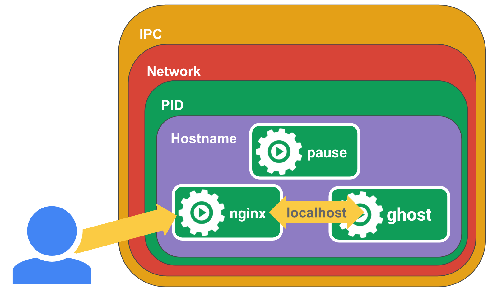

# (翻)pause容器解析

[The Almighty Pause Container](https://www.ianlewis.org/en/almighty-pause-container)

[The Almighty Pause Container](https://www.ianlewis.org/en/almighty-pause-container)

## 前言

当您在`Kubernetes`集群的节点上执行，`docker ps`时，您会发现一些名为`pause`的容器正在运行:
```shell
$ docker ps
CONTAINER ID        IMAGE                           COMMAND ...
...
3b45e983c859        gcr.io/google_containers/pause-amd64:3.0    "/pause" ...
...
dbfc35b00062        gcr.io/google_containers/pause-amd64:3.0    "/pause" ...
...
c4e998ec4d5d        gcr.io/google_containers/pause-amd64:3.0    "/pause" ...
...
508102acf1e7        gcr.io/google_containers/pause-amd64:3.0    "/pause" ...
```

> 您可能很好奇：这些`pause`容器是什么? 为什么会有这么多这样的容器?

为了回答这些问题，您需要了解`Kubernetes`中的`pod`是如何实现的（尤其是基于常用的容器运行时：`Docker/containerd`），
如果您对`pod`的实现原理不是很了解，请参考[What are Kubernetes Pods Anyway?](https://www.ianlewis.org/en/what-are-kubernetes-pods-anyway)

我们都知道利用`Docker`启动运行单一进程的容器很简单， 然而当您想要同时运行多个软件组件时，这个模型可能会变得有点麻烦。

当开发人员创建`Docker`映像时，您经常会看到这种情况，这些映像使用`entrypoint`作为入口点来启动和管理多个进程。

对于生产系统，许多人发现将这些应用程序部署在部分隔离且部分共享环境的容器组中更为有用。

`Kubernetes`针对上述场景的需求，提供了一个称为`pods`的抽象。它屏蔽了`Docker`标志的复杂性（如启动个容器可能需要传递多个标识: `docker run -itd --name ddd -v /etc/hosts:/etc/hosts nginx`），以及管理容器、共享卷等操作。它还隐藏了容器运行时之间的差异，例如，`rkt`原生支持`pod`，因此`Kubernetes`要做的工作较少，但作为`Kubernetes`的用户，您不必担心这一点。

> 事实上，`Docker`原生就具备控制容器组之间的共享级别的能力——通过创建一个父容器，例如：

1. 创建容器`A`，作为父容器，容器`ID`假设为`A-ID`
2. 创建容器`B`，作为子容器，容器`ID`假设为`B-ID`，启动时指定`PID`命名空间标识为`--pid=container:A-ID`
3. 创建容器`C`，作为子容器，容器`ID`假设为`C-ID`，启动时指定`PID`命名空间标识为`--pid=container:A-ID`

此时，容器`B`与容器`C`共享相同的`PID`命名空间(即容器`A`的`PID`命名空间)

通过上面的例子我们发现，使用原生的容器运行时实现起来比较繁琐，因为首先您得了解创建流程、所使用的标识，并管理这些容器的生命周期。

而在`Kubernetes`中，`pause`容器作为您`pod`中所有容器的`父容器`。
`pause`容器有两个核心职责：
- 首先，它作为在`pod`中共享`Linux`名称空间的基础容器。
- 其次，启用`PID`(进程`ID`)名称空间共享后，它将作为每个`pod`的`PID 1`进程（根进程），并回收僵尸进程。


接下来我们针对`pause`容器的职责逐一解析

## 关于共享命名空间

在`Linux`中，当运行一个新进程时，该进程从父进程继承其名称空间。
在新的命名空间中运行进程的方法是通过与父进程`取消共享`命名空间，从而创建一个新的命名空间。

下面是使用`unshare`工具在新的`PID、UTS、IPC`和`mount`名称空间中运行`shell`的示例。

```shell
$ sudo unshare --pid --uts --ipc --mount -f chroot rootfs /bin/sh
```

一旦进程运行，您可以将其他进程添加到进程的名称空间中，以形成一个`pod`。可以使用`setns`系统调用将新的进程添加到现有的命名空间中。

而`pod`的容器之间共享名称空间也是基于这个原理实现的。

`Docker`的实现则是将这个过程自动化一些，所以让我们看一个例子，看看如何通过使用`pause`容器和共享名称空间从头创建一个`pod`。

1. 首先，我们需要使用`Docker`启动`pause`容器，并作端口映射，以便我们可以将容器添加到`pod`中。

```shell
$ docker run -d --name pause -p 8080:80 gcr.io/google_containers/pause-amd64:3.0
```

2. 接下来为我们的`pod`容器，首先我们运行一个`nginx`容器，调整`nginx`的代理配置：监听`80`请求，并将请求转发至本地`2368`端口。

```shell
$ cat <<EOF >> nginx.conf
> error_log stderr;
> events { worker_connections  1024; }
> http {
>     access_log /dev/stdout combined;
>     server {
>         listen 80 default_server;
>         server_name example.com www.example.com;
>         location / {
>             proxy_pass http://127.0.0.1:2368;
>         }
>     }
> }
> EOF
$ docker run -d --name nginx -v `pwd`/nginx.conf:/etc/nginx/nginx.conf --net=container:pause --ipc=container:pause --pid=container:pause nginx
```

3. 接下来创建一个`ghost`博客应用容器，作为服务端，端口监听为`2368`

```shell
$ docker run -d --name ghost --net=container:pause --ipc=container:pause --pid=container:pause ghost
```

通过上面的操作，我们将`pause`容器`Network`、`PID`、`IPC`命名空间共享给`nginx`与`ghost`容器，即三个容器共享相同`Network`、`PID`、`IPC`命名空间。
此时，当您访问`http://localhost:8080/`，实际被代理至`ghost`服务，流程如下:

a. 容器宿主机访问`http://localhost:8080/`
b. 请求被转发至`pause`容器`80`端口，即`nginx`容器`80`端口
c. `nginx`将请求转发至本地`2368`端口，即`ghost`容器`2368`端口



显然，原生实现的流程还是比较复杂的（这还没有包括监控、管理这些容器生命周期）

## 关于回收僵尸进程

在`Linux`中，`PID`命名空间中的进程是一个树型结构，每个进程有一个父进程。在树的根上只有一个进程没有真正的父进程。这是`init`进程，其`PID`为`1`。

进程可以使用`fork`和`exec`系统调用来启动其他进程，此时新进程的父进程就是调用`fork syscal`的进程。

其中`fork`用于启动正在运行的进程的另一个副本，`exec`用于用一个新进程替换当前进程，保持相同的`PID`。

为了运行一个完全独立的应用程序，您需要运行`fork`和`exec`系统调用。一个进程使用`fork`用一个新的`PID`创建一个自己的新副本作为子进程，然后当子进程运行时，它检查它是否是子进程，并运行`exec`来用您真正想运行的进程替换它自己。

大多数语言都通过一个函数来实现这一点。

每个进程在系统进程表中都有一个条目，它记录进程状态和退出代码的信息。
当子进程完成运行后，它的进程表条目将一直保持到父进程使用`wait`系统调用检索其退出代码为止。这被称为`回收`僵尸进程。

> 什么是僵尸进程？

僵尸进程是指已经停止运行但它们的进程表条目仍然存在的进程，因为父进程没有通过`wait`系统调用检索它。
从技术上讲，每个终止的进程在很短的一段时间内都是僵尸，但它们可以存活更长时间。

在`UNIX`系统中,一个子进程结束了,但是它的父进程没有等待(调用`wait/waitpid`)它, 那么它将变成一个僵尸进程.

> 孤儿进程 & 僵尸进程

- 孤儿进程：一个父进程退出，而它的一个或多个子进程还在运行，那么那些子进程将成为孤儿进程。孤儿进程将被`init`进程(进程号为1)所接管，并由`init`进程对它们完成状态收集工作。

- 僵尸进程：一个进程使用`fork`系统调用创建子进程，如果子进程退出，而父进程并没有调用`wait`或`waitpid`获取子进程的状态信息，那么子进程的进程描述符仍然保存在系统中。这种进程称之为僵尸进程。


> 僵尸进程是怎么产生的？

出现僵尸进程的一种情况是：

父进程编写得很糟糕，省略了`wait`调用，或者父进程在子进程之前死亡，而新的父进程没有调用`wait`。

当一个进程的父进程在子进程之前死亡时，操作系统将该子进程分配给`init`进程或`PID 1`的进程。即`init`进程`接纳`子进程并成为其父进程。这意味着，现在当子进程退出时，新的父进程(`init`)必须调用`wait`来获取它的退出码，否则它的进程表条目将永远保留下来，成为僵死进程。

在容器中，应用运行的进程必须是`init`进程。在`Docker`中，每个容器通常都有自己的`PID`命名空间，`ENTRYPOINT`进程是`init`进程。当`A`容器在`B`容器的名称空间中运行时，`B`容器必须承担`init`进程的角色，而其`A`容器作为`init`进程的子进程添加到命名空间中。

```shell
$ docker run -d --name nginx -v `pwd`/nginx.conf:/etc/nginx/nginx.conf -p 8080:80 nginx
$ docker run -d --name ghost --net=container:nginx --ipc=container:nginx --pid=container:nginx ghost
```

在这个例子中，`nginx`的角色是`PID 1`, `ghost`被添加为`nginx`的子进程。

当`ghost`自身分叉或使用`exec`运行子进程，并且`ghost`进程在`ghost`子进程完成之前崩溃，那么这些`ghost`孤儿子进程将被`nginx`进程接管。当这些孤儿进程完成退出时，它一直等待父进程（nginx进程）使用`wait`系统调用检索其退出代码。不幸的是`nginx`并没有被设计成能够作为一个`init`进程来运行并回收僵尸。

当我们存在很多这种`容器组`时，将可能导致很多容器内的僵尸进程无法回收。

> 僵尸进程的危害

僵尸进程会占用进程号，以及未回收的文件描述符占用空间，如果产生大量的僵尸进程，将会导致系统无法分配进程号

> pod实现

在`Kubernetes pod`中，容器的运行方式与上述基本相同，但是为每个`pod`创建了一个特殊的`pause`容器。

这个`pause`容器运行了一个非常简单的进程，它不执行任何函数，本质上永远休眠(参见下面的pause()调用)。

其源码实现:

```
/*
Copyright 2016 The Kubernetes Authors.
Licensed under the Apache License, Version 2.0 (the "License");
you may not use this file except in compliance with the License.
You may obtain a copy of the License at
    http://www.apache.org/licenses/LICENSE-2.0
Unless required by applicable law or agreed to in writing, software
distributed under the License is distributed on an "AS IS" BASIS,
WITHOUT WARRANTIES OR CONDITIONS OF ANY KIND, either express or implied.
See the License for the specific language governing permissions and
limitations under the License.
*/

#include <signal.h>
#include <stdio.h>
#include <stdlib.h>
#include <sys/types.h>
#include <sys/wait.h>
#include <unistd.h>

static void sigdown(int signo) {
  psignal(signo, "Shutting down, got signal");
  exit(0);
}

static void sigreap(int signo) {
  while (waitpid(-1, NULL, WNOHANG) > 0);
}

int main() {
  if (getpid() != 1)
    /* Not an error because pause sees use outside of infra containers. */
    fprintf(stderr, "Warning: pause should be the first process\n");

  if (sigaction(SIGINT, &(struct sigaction){.sa_handler = sigdown}, NULL) < 0)
    return 1;
  if (sigaction(SIGTERM, &(struct sigaction){.sa_handler = sigdown}, NULL) < 0)
    return 2;
  if (sigaction(SIGCHLD, &(struct sigaction){.sa_handler = sigreap,
                                             .sa_flags = SA_NOCLDSTOP},
                NULL) < 0)
    return 3;

  for (;;)
    pause();
  fprintf(stderr, "Error: infinite loop terminated\n");
  return 42;
}
```

如你所见，它不仅仅处于休眠状态。它还有另外一个重要的功能。

从上述代码种我们发现，`pause`容器不仅仅调用`pause()`使进程休眠，还拥有另外一个重要的功能：

它假定自己为`PID 1`的角色，当僵尸进程被其父进程孤立时，通过调用`wait`来获取僵尸进程(见sigreap)。 这样一来就不会在`Kubernetes pod`的`PID`命名空间中堆积僵尸进程了。

## 关于进程命名空间共享说明

默认情况下，`kubernetes`同一`pod`内的容器不共享进程命名空间，需要指定配置。这意味着默认情况下，各个容器需要自己管理僵尸进程。
