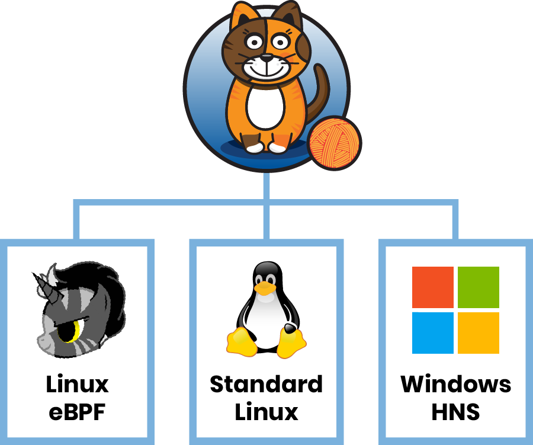
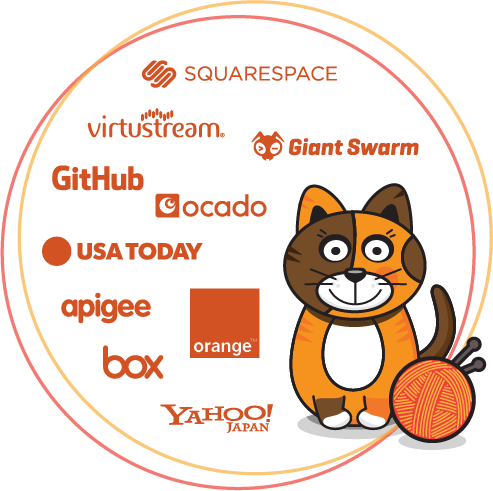

# Calico介绍
[官方文档地址](https://docs.projectcalico.org/)

## Calico是什么?

`Calico`是一个面向容器、虚拟机、基于原生主机的工作负载的开源网络和网络安全解决方案。

`Calico`支持广泛的平台，包括`Kubernetes`、`OpenShift`、`Docker EE`、`OpenStack`和裸金属服务器。

`Calico`的`eBPF`数据平面与`Linux`的标准网络管道，提供了惊人的性能和真正的云原生可伸缩性。

## 为什么使用Calico?

### 可选的数据面

可选性更多：`Calico`为您提供了一个数据面选择，包括一个纯`Linux eBPF`数据面、一个标准`Linux`网络数据面和一个`Windows HNS`数据面。

无论哪种选择适合您，您都将获得相同的、易于使用的基础网络、网络策略和`IP`地址管理功能，这些功能使`Calico`成为云原生应用程序最值得信赖的网络和网络策略解决方案。

### 网络安全的最佳实践

`Calico`丰富的网络策略模型可以很容易地锁定通信，加上内置的支持`Wireguard`加密，确保您的`pod`间的流量安全可靠

`Calico`的策略引擎可以在主机网络层和在服务网格层(如`Istio & Envoy`)执行相同的策略模型，保护基础设施不受损害的工作负载影响，保护工作负载不受损害的基础设施的影响。

### 优异的性能

根据您的偏好，`Calico`使用`Linux eBPF`或`Linux`内核高度优化的标准网络管道来提供高性能的网络。
`Calico`的网络选项足够灵活，可以在大多数环境中不使用覆盖运行，避免了封装`encap/decap`的开销。
`Calico`的控制平面和策略引擎在多年的生产使用中经过优化，使得`CPU`使用和占用率较低。

### 可伸缩性
    
`Calico`基于云原生设计模式，并结合了世界上最大的互联网运营商所信任的经过验证的基于标准的网络协议。
其结果是一个具有特殊可伸缩性的解决方案，多年来一直在大规模生产中运行。`Calico`的开发测试周期包括定期测试数千个节点集群，保证了优异的性能和可伸缩性。

### 兼容性

`Calico`使`Kubernetes`工作负载和非`Kubernetes`工作负载能够无缝、安全地通信。`Kubernetes pods`是您网络上的一等公民，能够与网络上的任何其他工作负载进行通信。

此外，`Calico`还可以保护现有的基于主机的工作负载（无论是在公共云中还是在`VMs`或裸机服务器上）。所有工作负载都受相同的网络策略模型的约束，因此唯一允许流动的流量是您期望流动的流量。

### 经过生产环境验证

`Calico`深受包括`SaaS`提供商、金融服务公司和制造商在内的大型企业的信任和生产。
最大的公共云提供商已经选择`Calico`为其托管的`Kubernetes`服务(Amazon EKS、Azure AKS、谷歌GKE和IBM IKS)提供网络安全性，这些服务运行在数万个集群中

### 完全支持Kubernetes网络策略

在开发`API`期间，`Calico`的网络策略引擎参考`Kubernetes`原生网络策略的实现。
`Calico`的区别在于它实现了`API`定义的全部特性，为用户提供了定义`API`时所设想的所有功能和灵活性。
对于那些需要更强大功能的用户，`Calico`支持一组扩展的网络策略功能，这些功能与`Kubernetes API`无缝协作，为用户在定义网络策略方面提供了更大的灵活性。

# Calico实践

## Calico网络选型

### Kubernetes网络基础知识
    
`Kubernetes`网络模型定义了一个"扁平"网络，其中:

- 每个`Pod`拥有自己的`IP`地址
- 任何节点上的`pod`都可以在没有`NAT`的情况下与所有其他节点上的`pod`通信

这创建了一个干净、向后兼容的模型，从端口分配、命名、服务发现、负载平衡、应用程序配置和迁移的角度来看，
`pod`可以像`vm`或物理主机一样对待。可以使用网络策略来定义网络分段，以限制这些基本网络功能内的通信。

在这个模型中，对于支持不同的网络方法和环境有很大的灵活性。网络实现的具体细节取决于使用的`CNI`、网络和云提供商插件的组合

### CNI插件

`CNI`(`Container Network Interface`容器网络接口)是一个标准的`API`，允许不同的网络实现接入到`Kubernetes`中。
`Kubernetes`在创建或销毁`pod`时调用`API`。`CNI`插件有两种类型:

- `CNI`网络插件：负责向`Kubernetes pod`网络添加或删除`pod`。这包括创建/删除每个`pod`的网络接口，并将其连接/断开与其余网络实现的连接。
- `CNI IPAM`插件：负责在`pod`被创建或删除时为`pod`分配和释放`IP`地址。根据插件的不同，这可能包括为每个节点分配一个或多个`IP`地址范围（CIDR），或者从底层公共云的网络获取`IP`地址以分配给`POD`。

### Overlay网络

在底层网络不知道连接到`overlay`覆盖网络的设备的情况下，`overlay`覆盖网络允许网络设备通过底层网络进行通信。
从连接到`overlay`覆盖网络的设备的角度来看，它看起来就像一个普通的网络。
有许多不同类型的`overlay`覆盖网络，它们使用不同的协议来实现这一点，但通常它们都有一个共同的特征，取一个网络包，称为内部包，并将它封装在一个外部网络包中。通过这种方式，底层可以看到外部包，而不需要了解如何处理内部包。

`overlay`如何知道将包发送到哪里取决于`overlay`的类型和它们使用的协议。
同样，数据包的包装方式在不同的覆盖类型之间也有所不同。以`VXLAN`为例，内部报文被封装，外部报文以`UDP`协议发送。

`overlay`网络的优点是对底层网络基础设施的依赖性最小，但有以下缺点:

- 如果运行网络密集型工作负载，与非覆盖网络相比，性能影响较小，
- `overlay`上的工作负载不容易从网络的其余部分寻址。因此，`NAT`网关或负载均衡器需要桥接`overlay`和底层网络。

`Calico`网络选项是非常灵活的，所以通常你可以选择是否你喜欢`Calico`提供覆盖网络，或非覆盖网络。
你可以在`Calico`确定最佳网络选项指南中了解更多。

### 跨子网Overlay网络

除了标准的`VXLAN`或`IP-In-IP`覆盖，`Calico`还支持`VXLAN`和`IP-In-IP`的"跨子网"模式。在这种模式下，在每个子网中，底层网络充当`L2`网络。
在单个子网内发送的数据包不会被封装，因此可以获得非覆盖网络的性能。通过子网发送的数据包被封装，就像普通的覆盖网络一样，减少了对底层网络的依赖性（无需与底层网络集成或对底层网络进行任何更改）

与标准覆盖网络一样，底层网络不知道`pod IP`地址，`pod IP`地址不能在集群外部路由。

### 集群外部的Pod IP可路由性

不同`Kubernetes`网络实现的一个重要区别是`pod IP`地址是否可以通过更广泛的网络在集群之外路由

#### 不可路由

如果`Pod IP`地址集群外不可路由,当一个`Pod`试图建立一个网络连接集群外的一个`IP`地址,
`Kubernetes`使用了一种叫做`SNAT`(来源网络地址转换)来改变源`IP`地址的`IP`地址,
`IP`地址的节点承载`Pod`。连接上的任何返回包都会自动映射回`pod IP`地址。
因此，`pod`对`SNAT`无感知，连接的目的地将节点视为连接的源，集群之外的网络永远不会看到`pod IP`地址。

对于相反方向的连接，集群外部需要连接到`pod`情况下，这只能通过`Kubernetes services`或`Kubernetes ingress`来实现。
集群之外不能直接连接到`pod IP`地址，因为集群之外的的网络不知道如何将数据包路由到`pod IP`地址

#### 可路由

如果`pod IP`地址可在集群外部路由，那么`pod`可以连接到外部世界而无需`SNAT`，
并且外部世界可以直接连接到`pod`而无需通过`Kubernetes`服务或`Kubernetes`入口。

集群外部可路由`pod IP`地址的优点是：

- 避免出站连接`SNAT`，简化操作日志的调试和理解
- `pod`需要直接访问，而无需通过`Kubernetes`服务或`Kubernetes`入口，那么可路由`pod ip`在操作上可能比使用主机网络`pod`更简单

在集群外部可路由的`pod IP`地址的主要缺点是，`pod IP`在更广泛的网络中必须是唯一的。
例如，如果运行多个集群，则需要为每个集群中的`pods`使用不同的`IP`地址范围(CIDR)。
在大规模运行时，或者在现有企业对`IP`地址空间有其他重大需求时，这会导致`IP`地址范围耗尽。

### BGP

`BGP`（Border Gateway Protocol）是一种基于标准的网络协议，用于在网络上共享路由。它是互联网的基本组成部分之一，具有非凡的扩展特性。

`Calico`内置了对`BGP`的支持。在`on-prem`部署中，这允许`Calico`与物理网络（通常是顶部或机架路由器）对等以交换路由，从而形成一个非覆盖网络，其中`pod IP`地址可在更广泛的网络上路由，就像连接到网络的任何其他工作负载一样。

