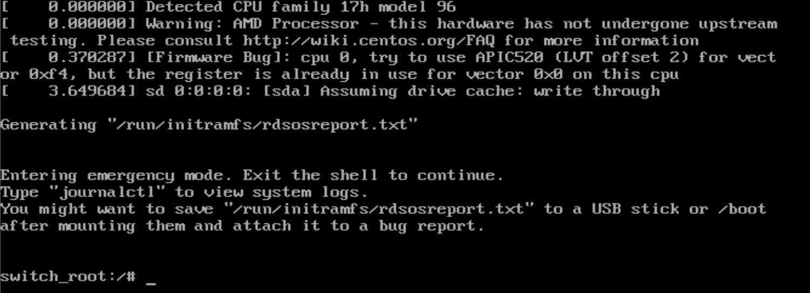

## cap_chroot能力分析

- `cap_sys_chroot`: 允许使用`chroot()`系统调用

`chroot`指令是其具体实现,我们首先了解下`chroot`指令

> `chroot`能用来干什么？

首先了解下`chroot`的含义：`change root directory`

默认情况下`linux`的目录均以'/'起始，如:

- `/etc`
- `/usr/local/sbin`
- `/root`

而`chroot`则可以变更文件系统的根，比如可以通过

`chroot`大致功能如下：

1. 通过变更根目录，增加了系统的安全性，限制了用户的权力：

在经过`chroot`之后，在新的根下将访问不到旧系统的根目录结构和文件，这样就增强了系统的安全性。

一般会在用户登录前应用`chroot`，把用户的访问能力控制在一定的范围之内。

2. 建立一个与原系统隔离的系统目录结构，方便用户的开发

使用`chroot`后，系统读取的是新根下的目录和文件，这是一个与原系统根下文件不相关的目录结构。在这个新的环境中，可以用来测试软件的静态编译以及一些与系统不相关的独立开发。

4. 切换系统的根目录位置，引导`Linux`系统启动以及急救系统等：

`chroot`的作用就是切换系统的根位置，而这个作用最为明显的是在系统初始引导磁盘的处理过程中使用，从初始`RAM`磁盘 (`initrd`) 切换系统的根位置并执行真正的`init`

接下来我们可以通过以下两个例子，进一步了解`chroot`

### chroot实践1: 重置root口令

比较常用的一个例子就是用来重置`root`口令(忘记`root`口令场景，也可通过单用户模式重置)

下来我们简单演示下具体流程

1. 开机/重启操作系统，进入引导流程
2. 选择内核界面，键入`e`对引导逻辑执行编辑


3. 找到下面框住的那行


4. 在行末尾（`en_US.UTF-8`后）添加`rd.break`，注意空格间隔


5. 键入`ctrl+x`组合键保存修改内容，进入`switch_root`模式



7. 查看挂载点


框住的内容是我们进行下一步所需要的信息:

- 第一个框说明此时的根目录在一个`RAM disk`中, 即`rootfs`
- 第二个框说明当前文件系统挂载于`/sysroot`目录，并且是只读的模式

8. 修改`/sysroot`挂载点为读写模式

```shell
switch_root:/# mount -o remount,rw /sysroot
```

9. 利用`chroot`切换根目录至`/sysroot`

```shell
switch_root:/# chroot /sysroot
```

10. 重置`root`口令

```shell
sh-4.2# echo "new_root_pw" | passwd --stdin root
```

11. 创建`/.autorelabel`文件，确保开机时重新设定`SELinux context`（`selinux`标签验证,即允许你修改密码）

```shell
sh-4.2# touch /.autorelabel
```

**注意：** 这一步骤很关键，如果修改密码后不执行这一步骤，重启操作系统后将不会登录成功

12. 退出`chroot`

```shell
sh-4.2# exit
```

13. 再次执行退出，系统会自动重新开机

```shell
switch_root:/# exit
```

### chroot实践2: 打造一个ssh监狱

1. 创建`ssh`登陆后的活动范围

```shell
$ mkdir -p /home/ssh
```

2. 接下来，根据`sshd_config`手册找到所需的文件，`ChrootDirectory`选项指定在身份验证后要`chroot`到的目录的路径名。
该目录必须包含支持用户会话所必需的文件和目录

```shell
$ ls -l /dev/{null,zero,stdin,stdout,stderr,random,tty}
crw-rw-rw-. 1 root root 1, 3 Nov  8 02:08 /dev/null
crw-rw-rw-. 1 root root 1, 8 Nov  8 02:08 /dev/random
lrwxrwxrwx. 1 root root   15 Nov  8 02:08 /dev/stderr -> /proc/self/fd/2
lrwxrwxrwx. 1 root root   15 Nov  8 02:08 /dev/stdin -> /proc/self/fd/0
lrwxrwxrwx. 1 root root   15 Nov  8 02:08 /dev/stdout -> /proc/self/fd/1
crw-rw-rw-. 1 root tty  5, 0 Nov  8 02:08 /dev/tty
crw-rw-rw-. 1 root root 1, 5 Nov  8 02:08 /dev/zero
```

对于交互式会话，这需要至少一个`shell`，通常为`sh`和基本的`/dev`节点，例如`null`、`zero`、`stdin`、`stdout`、`stderr`和`tty`设备

3. 通过`mknod`命令创建`/dev`下的文件

在下面的命令中，`-m`标志用来指定文件权限位，`c`意思是字符文件，两个数字分别是文件指向的主要号和次要号

```shell
$ mkdir -p /home/ssh/dev
$ cd /home/ssh/dev
$ mknod -m 666 null c 1 3
$ mknod -m 666 tty c 5 0
$ mknod -m 666 zero c 1 5
$ mknod -m 666 random c 1 8
```

4. 在`chroot`监狱中设置合适的权限 

**注意:** `chroot`监狱和它的子目录以及子文件必须被`root`用户所有，并且对普通用户或用户组不可

```shell
$ chown root:root /home/ssh
$ chmod 0755 /home/ssh
$ ls -ld /home/ssh
drwxr-xr-x. 3 root root 17 Nov  8 02:28 /home/ssh
```

5. 为`SSH chroot`监狱设置交互式`shell`

首先，创建`bin`目录并复制`/bin/bash`到`bin`中

```shell
$ mkdir -p /home/ssh/bin
$ cp -v /bin/bash /home/ssh/bin
```

接下来获取`bash`所需的共享库，并复制它们到`lib64`中：

```shell
$ ldd /bin/bash
        linux-vdso.so.1 =>  (0x00007fffc9f70000)
        libtinfo.so.5 => /lib64/libtinfo.so.5 (0x00007f541ac98000)
        libdl.so.2 => /lib64/libdl.so.2 (0x00007f541aa94000)
        libc.so.6 => /lib64/libc.so.6 (0x00007f541a6c6000)
        /lib64/ld-linux-x86-64.so.2 (0x00007f541aec2000)
$ mkdir -p /home/ssh/lib64
$ cp -v /lib64/{libtinfo.so.5,libdl.so.2,libc.so.6,ld-linux-x86-64.so.2} /home/ssh/lib64
```

6. 创建`SSH`用户，并初始化密码

```shell
$ useradd -m ddd && echo "123456" | passwd --stdin ddd
```

7. 创建`chroot`监狱通用配置目录`/home/ssh/etc`并复制已更新的账号文件（`/etc/passwd`和`/etc/group`）到这个目录中

```shell
$ mkdir /home/ssh/etc
$ cp -vf /etc/{passwd,group} /home/ssh/etc/
```

8. 配置`SSH`来使用`chroot`监狱

```shell
$ cat >> /etc/ssh/sshd_config <<EOF
Match User ddd
ChrootDirectory /home/ssh
EOF

$ systemctl restart sshd
```

9. 测试`SSH`的`chroot`监狱

新建`ssh`会话，会话信息如下：

- 用户: `ddd`
- 密码: `123456`

尝试执行一些命令：

```shell
-bash-4.2$ ls
-bash: ls: command not found
-bash-4.2$ pwd
/
-bash-4.2$ clear
-bash: clear: command not found
```

从结果来看，我们可以看到`ddd`用户被锁定在了`chroot`监狱中，并且不能使用任何外部命令如（`ls、date、uname`等等）。

用户只可以执行`bash`以及它内置的命令（比如：`pwd、history、echo`等等）

10. 创建用户的主目录并添加`Linux`命令

从前面的步骤中，我们可以看到用户被锁定在了`root`目录，我们可以为`SSH`用户创建一个主目录（以及为所有将来的用户这么做）：

```shell
$ mkdir -p /home/ssh/home/ddd
$ chown -R ddd:ddd /home/ssh/home/ddd
$ chmod -R 0700 /home/ssh/home/ddd
```

添加几个指令

```shell
$ cp -v /bin/{ls,mkdir} /home/ssh/bin
```

将指令的共享库拷贝至`chroot`监狱中

- `ls`

```shell
$ ldd /usr/bin/ls
        linux-vdso.so.1 =>  (0x00007ffdafdf5000)
        libselinux.so.1 => /lib64/libselinux.so.1 (0x00007f817932d000)
        libcap.so.2 => /lib64/libcap.so.2 (0x00007f8179128000)
        libacl.so.1 => /lib64/libacl.so.1 (0x00007f8178f1f000)
        libc.so.6 => /lib64/libc.so.6 (0x00007f8178b51000)
        libpcre.so.1 => /lib64/libpcre.so.1 (0x00007f81788ef000)
        libdl.so.2 => /lib64/libdl.so.2 (0x00007f81786eb000)
        /lib64/ld-linux-x86-64.so.2 (0x00007f8179554000)
        libattr.so.1 => /lib64/libattr.so.1 (0x00007f81784e6000)
        libpthread.so.0 => /lib64/libpthread.so.0 (0x00007f81782ca000)
$ \cp -v /lib64/{libselinux.so.1,libcap.so.2,libacl.so.1,libc.so.6,libpcre.so.1,libdl.so.2,ld-linux-x86-64.so.2,libattr.so.1,libpthread.so.0} /home/ssh/lib64
```

- `mkdir`

```shell
$ ldd /usr/bin/mkdir
$ \cp /lib64/{libselinux.so.1,libc.so.6,libpcre.so.1,libdl.so.2,ld-linux-x86-64.so.2,libpthread.so.0} /home/ssh/lib64
```

测试指令是否可用

```shell
-bash-4.2$ /bin/ls /
bin  dev  etc  home  lib64
-bash-4.2$ /bin/mkdir -p ddd2
-bash-4.2$ /bin/ls
ddd2
```

此时`ddd`被限制到了指定的目录中，而从其视角来看与正常操作系统并无大的区别，只是仅能执行少数的操作，少了很多系统目录/文件。

通过上述两个例子，我们了解了`cap_chroot`的一些常用使用场景及功能。

与其他`CAP`类似，默认非特权用户无法调用`chroot()`函数:

```shell
$ su - ddd
Last login: Mon Nov  8 03:16:29 EST 2021 from 192.168.109.1 on pts/2
$ mkdir ttt
$ chroot ttt
chroot: cannot change root directory to ttt: Operation not permitted
```

此时需要在`root`对可执行文件`chroot`添加`cap_sys_chroot`能力

```shell
$ whoami
root
$ setcap cap_sys_chroot+ep /usr/sbin/chroot
```

再次切换至普通用户测试其调用

```shell
$ su - ddd
Last login: Mon Nov  8 03:37:18 EST 2021 on pts/0
$ mkdir ccc
$ chroot ccc
chroot: failed to run command ‘/bin/bash’: No such file or directory
```

显然已具备权限，异常原因是因为没有设置`bash`

```shell
$ mkdir ccc/bin
$ cp /usr/bin/bash ccc/bin/
$ ldd /bin/bash
        linux-vdso.so.1 =>  (0x00007fffc9f70000)
        libtinfo.so.5 => /lib64/libtinfo.so.5 (0x00007f541ac98000)
        libdl.so.2 => /lib64/libdl.so.2 (0x00007f541aa94000)
        libc.so.6 => /lib64/libc.so.6 (0x00007f541a6c6000)
        /lib64/ld-linux-x86-64.so.2 (0x00007f541aec2000)
$ mkdir -p ccc/lib64
$ cp -v /lib64/{libtinfo.so.5,libdl.so.2,libc.so.6,ld-linux-x86-64.so.2} ccc/lib64
$ chroot ccc
bash-4.2$ pwd
/
```

**注意：** 这里为了更好的解释说明，直接使用了`chroot`指令（chroot()调用的一个实现）进行分析`cap_sys_chroot`。

并不是指`cap_sys_chroot`开启后，普通用户就能使用`chroot`指令了，而实际是指：
当可执行文件（`chroot`或其他有`chroot()`调用的二进制文件）及进程具备了调用`chroot()`权限。

### 参考文章

[linux chroot 命令](https://www.cnblogs.com/sparkdev/p/8556075.html)

[使用 chroot 监狱限制 SSH 用户访问指定目录](https://linux.cn/article-8313-1.html)