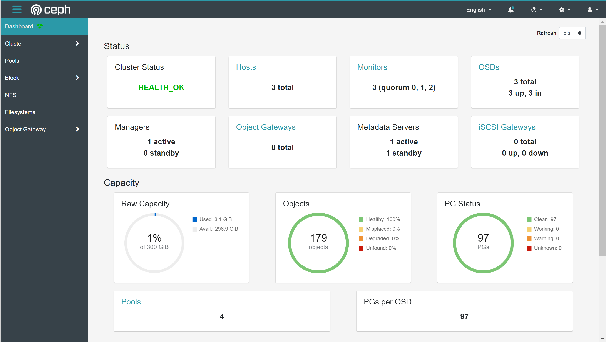
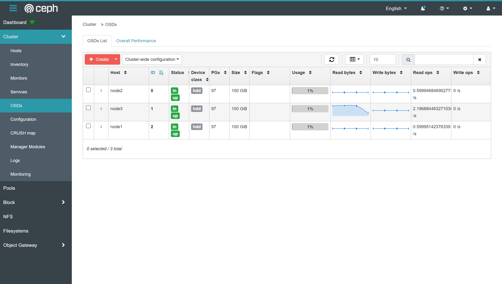
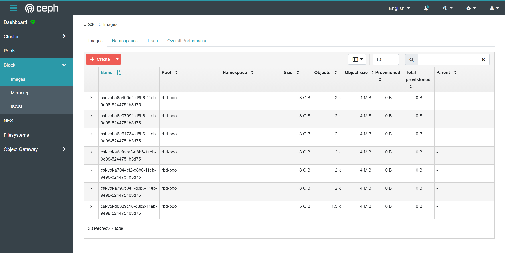
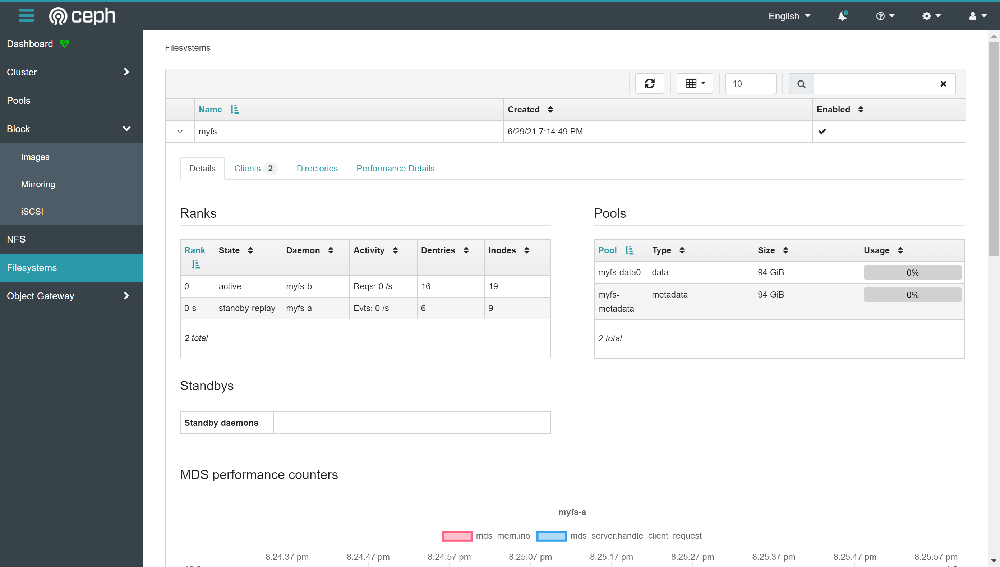

<!-- START doctoc generated TOC please keep comment here to allow auto update -->
<!-- DON'T EDIT THIS SECTION, INSTEAD RE-RUN doctoc TO UPDATE -->
**Table of Contents**  *generated with [DocToc](https://github.com/thlorenz/doctoc)*

- [Rook](#rook)
  - [Rook架构设计](#rook%E6%9E%B6%E6%9E%84%E8%AE%BE%E8%AE%A1)
- [Rook实践](#rook%E5%AE%9E%E8%B7%B5)
  - [Rook管理ceph-基础版](#rook%E7%AE%A1%E7%90%86ceph-%E5%9F%BA%E7%A1%80%E7%89%88)
    - [环境说明](#%E7%8E%AF%E5%A2%83%E8%AF%B4%E6%98%8E)
    - [依赖说明](#%E4%BE%9D%E8%B5%96%E8%AF%B4%E6%98%8E)
    - [开启准入控制器](#%E5%BC%80%E5%90%AF%E5%87%86%E5%85%A5%E6%8E%A7%E5%88%B6%E5%99%A8)
    - [创建rook operator](#%E5%88%9B%E5%BB%BArook-operator)
    - [创建ceph集群](#%E5%88%9B%E5%BB%BAceph%E9%9B%86%E7%BE%A4)
    - [创建ceph工具箱](#%E5%88%9B%E5%BB%BAceph%E5%B7%A5%E5%85%B7%E7%AE%B1)
    - [创建块存储](#%E5%88%9B%E5%BB%BA%E5%9D%97%E5%AD%98%E5%82%A8)
    - [创建共享存储](#%E5%88%9B%E5%BB%BA%E5%85%B1%E4%BA%AB%E5%AD%98%E5%82%A8)
    - [开启控制面板](#%E5%BC%80%E5%90%AF%E6%8E%A7%E5%88%B6%E9%9D%A2%E6%9D%BF)

<!-- END doctoc generated TOC please keep comment here to allow auto update -->

# Rook

## Rook架构设计
`Rook`使`Ceph`存储系统能够使用`Kubernetes`原生资源对象在`Kubernetes`上运行。
下图说明了`Ceph Rook`如何与`Kubernetes`集成：

通过在`Kubernetes`集群中运行`Ceph`，`Kubernetes`应用可以挂载`Rook`管理的块设备和文件系统，
或者可以使用`S3/swiftapi`进行对象存储。
`Rook operator`自动配置存储组件并监视集群，以确保存储保持可用和正常。

`Rook operator`是一个简单的容器，它拥有引导和监视存储集群所需的所有东西。
`operator`将启动和监控`Ceph monitor pods`, `Ceph OSD`守护进程提供`RADOS`存储，以及启动和管理其他`Ceph`守护进程。
`operator`通过初始化运行服务所需的`pods`和其他组件来管理池、对象存储(S3/Swift)和文件系统的`crd`。

`operator`将监视存储守护程序，以确保群集正常运行。`Ceph-mons`将在必要时启动或故障转移，
并随着集群的增长或收缩进行其他调整。`operator`还将监视`api`服务请求的所需状态更改，并应用更改。

`Rook operator`还初始化消耗存储所需的代理。`Rook`会自动配置`Ceph CSI`驱动程序，将存储装载到`pod`中。

`rook/ceph`镜像包括管理集群所需的所有工具。许多`Ceph`概念，如放置组和`crush map`是隐藏的。
`Rook`在物理资源、池、卷、文件系统和存储桶方面为管理员创建了一个非常简化的用户体验。同时，当需要`Ceph`工具时，可以应用高级配置

`Rook`基于`golang`实现。`Ceph`是基于`C++`中实现的，其中数据路径是高度优化的。二者是最好的组合。              

# Rook实践

## Rook管理ceph-基础版

### 环境说明

> `k8s`集群信息

    [root@node1 ~]# kubectl get nodes
    NAME    STATUS     ROLES           AGE    VERSION
    node1   Ready      master,worker   2d4h   v1.18.6
    node2   Ready      master,worker   2d4h   v1.18.6
    node3   Ready      master,worker   2d4h   v1.18.6

> 内核版本

    5.4.108-1.el7.elrepo.x86_64
    
> 磁盘设备

`node1-node3`各挂载一块`100G`磁盘，设备路径为`/dev/sdb`

### 依赖说明

> 要配置`Ceph`存储群集，至少需要以下一个本地存储选项：

- 原始设备（没有分区或格式化文件系统）
- 原始分区（无格式化文件系统）
- `k8s`存储类提供的块模式`PV`

> 安装`LVM`包

在以下场景中，`Ceph OSD`依赖于`LVM`：

- `OSD`是在原始设备或分区上创建的
- 如果启用了加密（encryptedDevice: true）
- 指定了元数据设备

在以下情况下，`OSD`不需要`LVM`：
- 使用`storageClassDeviceSets`在`PVC`上创建`OSD`

如果您的场景需要`LVM`，那么`LVM`需要在运行`OSD`的主机上可用。有些`Linux`发行版不附带`lvm2`包。
要运行`Ceph OSDs`，`k8s`群集中的所有存储节点上都需要此包。如果没有这个包，
即使`Rook`能够成功地创建`Ceph OSD`，当一个节点重新启动时，在重新启动的节点上运行的`OSD pods`将无法启动。
请使用`Linux`发行版的包管理器安装`LVM`。例如：

    yum install -y lvm2
    
> 操作系统内核

- `RBD`类型

`Ceph`需要一个用`RBD`模块构建的`Linux`内核。
许多`Linux`发行版都有这个模块，但不是所有发行版都有。例如，`GKE`容器优化`OS`（`COS`）没有`RBD`。

您可以通过运行`modprobe rbd`来测试`Kubernetes`节点

- `cephfs`类型

如果要从`Ceph`共享文件系统（`CephFS`）创建卷，建议的最低内核版本为`4.17`。

如果内核版本低于`4.17`，则不会强制执行所请求的`PVC`大小。存储配额将仅在较新的内核上强制执行。

### 开启准入控制器
   
准入控制器在对象持久化之前拦截到`Kubernetes API`服务器的请求，但在对请求进行身份验证和授权之后。

建议启用`Rook`准入控制器，以提供额外级别的验证，以确保`Rook`是使用自定义资源(`CR`)设置正确配置的。

> 下载`ceph`配置声明文件上传至`k8s`节点`/root`下,解压

- [rook-1.6.6.tar.gz](https://github.com/rook/rook/archive/refs/tags/v1.6.6.tar.gz)

    tar zxvf v1.6.6.tar.gz
    mv rook-1.6.6 rook

> 可利用助手脚本自动配置部署`Rook`准入控制器,这个脚本将帮助我们完成以下任务:

- 创建自签名证书
- 为证书创建证书签名请求（`CSR`），并从`Kubernetes`集群获得批准
- 将这些证书存储为`Kubernetes Secret`
- 创建`Service Account`、`ClusterRole`和`ClusterRoleBindings`，以便以最低权限运行`webhook`服务
- 创建`ValidatingWebhookConfig`并使用来自集群的适当值填充`CA bundle`

    cd rook/
    kubectl create -f cluster/examples/kubernetes/ceph/crds.yaml -f cluster/examples/kubernetes/ceph/common.yaml
    
离线环境下，手动下载[cert-manager.yaml](https://github.com/jetstack/cert-manager/releases/download/v1.2.0/cert-manager.yaml) 
上传至`/root/rook/`下，替换文件路径

    sed -i "s#https://github.com/jetstack/cert-manager/releases/download/\$CERT_VERSION/#rook/#g" \
    tests/scripts/deploy_admission_controller.sh

调整`/root/rook/cert-manager.yaml`文件内引用镜像`tag`(替换为可访问的镜像`tag`)

    [root@node1 rook]# cat cert-manager.yaml |grep 'image:'
            image: harbor.chs.neusoft.com/ceph-csi/jetstack/cert-manager-cainjector:v1.2.0
            image: harbor.chs.neusoft.com/ceph-csi/jetstack/cert-manager-controller:v1.2.0
            image: harbor.chs.neusoft.com/ceph-csi/jetstack/cert-manager-webhook:v1.2.0
   
发布
   
    tests/scripts/deploy_admission_controller.sh
    
### 创建rook operator

> 调整`/root/rook/cluster/examples/kubernetes/ceph/operator.yaml`文件内引用镜像`tag`(替换为可访问的镜像`tag`)

    [root@node1 rook]# grep "image:" cluster/examples/kubernetes/ceph/operator.yaml
              image: rook/ceph:v1.6.6
              
调整以下内容，并放开注释

    # ROOK_CSI_CEPH_IMAGE: "quay.io/cephcsi/cephcsi:v3.3.1"
    
    # ROOK_CSI_REGISTRAR_IMAGE: "k8s.gcr.io/sig-storage/csi-node-driver-registrar:v2.2.0"
    # ROOK_CSI_RESIZER_IMAGE: "k8s.gcr.io/sig-storage/csi-resizer:v1.2.0"
    # ROOK_CSI_PROVISIONER_IMAGE: "k8s.gcr.io/sig-storage/csi-provisioner:v2.2.2"
    # ROOK_CSI_SNAPSHOTTER_IMAGE: "k8s.gcr.io/sig-storage/csi-snapshotter:v4.1.1"
    # ROOK_CSI_ATTACHER_IMAGE: "k8s.gcr.io/sig-storage/csi-attacher:v3.2.1"
              
> 发布

    kubectl apply -f cluster/examples/kubernetes/ceph/operator.yaml
    
查看状态

    [root@node1 rook]# kubectl get pod -n rook-ceph
    NAME                                             READY   STATUS    RESTARTS   AGE
    rook-ceph-admission-controller-549f58dd9-rs8qs   1/1     Running   0          86s
    rook-ceph-admission-controller-549f58dd9-tmfnr   1/1     Running   0          86s
    rook-ceph-operator-869777bc74-dtv2h              1/1     Running   0          2m9s
    
    
此时，`operator`将自动启动准入控制器部署，而`Webhook`将开始拦截对`Rook`资源的请求。

### 创建ceph集群

`/root/rook/cluster/examples/kubernetes/ceph/cluster.yaml`

> 调整镜像`tag`

    ceph/ceph:v15.2.13
   
> 配置`ceph`数据盘 

修改以下配置，其他默认

      storage: # cluster level storage configuration and selection
        useAllNodes: true
        nodes:
        - name: "node1"
          devices: # specific devices to use for storage can be specified for each node
          - name: "sdb"
        - name: "node2"
          devices: # specific devices to use for storage can be specified for each node
          - name: "sdb"
        - name: "node3"
          devices: # specific devices to use for storage can be specified for each node
          - name: "sdb"
    
> 发布

    kubectl apply -f /root/rook/cluster/examples/kubernetes/ceph/cluster.yaml
    
> 查看状态

查看`pod`

    [root@node1 ceph]# kubectl get pod -n rook-ceph
    NAME                                             READY   STATUS    RESTARTS   AGE
    csi-cephfsplugin-jsw67                           3/3     Running   0          55s
    csi-cephfsplugin-provisioner-6667846fc9-g4jj2    6/6     Running   0          52s
    csi-cephfsplugin-provisioner-6667846fc9-wmzc7    6/6     Running   0          53s
    csi-cephfsplugin-tb4mh                           3/3     Running   0          55s
    csi-cephfsplugin-xvk4s                           3/3     Running   0          55s
    csi-rbdplugin-gl4tx                              3/3     Running   0          57s
    csi-rbdplugin-provisioner-7bf5687dcd-4rsst       6/6     Running   0          57s
    csi-rbdplugin-provisioner-7bf5687dcd-7hf94       6/6     Running   0          57s
    csi-rbdplugin-x57s2                              3/3     Running   0          57s
    csi-rbdplugin-zs64m                              3/3     Running   0          57s
    rook-ceph-admission-controller-549f58dd9-rs8qs   1/1     Running   0          18h
    rook-ceph-admission-controller-549f58dd9-tmfnr   1/1     Running   0          18h
    rook-ceph-mon-a-canary-6d7bf84b9c-pjmd4          1/1     Running   0          50s
    rook-ceph-mon-b-canary-5b647bf496-pdvhj          1/1     Running   0          50s
    rook-ceph-mon-c-canary-54d67bb847-8pb7x          1/1     Running   0          49s
    rook-ceph-operator-869777bc74-dtv2h              1/1     Running   0          18h
  
查看集群状态

    kubectl -n rook-ceph get CephCluster -o yaml
    
### 创建ceph工具箱

相当于`ceph`客户端，用于与`ceph`集群交互

> 创建发布

离线环境注意替换镜像`tag`(`rook/ceph:v1.6.6`)

    cat <<EOF | kubectl apply -f -
    apiVersion: apps/v1
    kind: Deployment
    metadata:
      name: rook-ceph-tools
      namespace: rook-ceph
      labels:
        app: rook-ceph-tools
    spec:
      replicas: 1
      selector:
        matchLabels:
          app: rook-ceph-tools
      template:
        metadata:
          labels:
            app: rook-ceph-tools
        spec:
          dnsPolicy: ClusterFirstWithHostNet
          containers:
          - name: rook-ceph-tools
            image: rook/ceph:v1.6.6
            command: ["/tini"]
            args: ["-g", "--", "/usr/local/bin/toolbox.sh"]
            imagePullPolicy: IfNotPresent
            env:
              - name: ROOK_CEPH_USERNAME
                valueFrom:
                  secretKeyRef:
                    name: rook-ceph-mon
                    key: ceph-username
              - name: ROOK_CEPH_SECRET
                valueFrom:
                  secretKeyRef:
                    name: rook-ceph-mon
                    key: ceph-secret
            volumeMounts:
              - mountPath: /etc/ceph
                name: ceph-config
              - name: mon-endpoint-volume
                mountPath: /etc/rook
          volumes:
            - name: mon-endpoint-volume
              configMap:
                name: rook-ceph-mon-endpoints
                items:
                - key: data
                  path: mon-endpoints
            - name: ceph-config
              emptyDir: {}
          tolerations:
            - key: "node.kubernetes.io/unreachable"
              operator: "Exists"
              effect: "NoExecute"
              tolerationSeconds: 5
    EOF
    
> 测试可用性

    [root@node1 ceph]# kubectl -n rook-ceph exec -it deploy/rook-ceph-tools -- bash
    
### 创建块存储

> 创建块存储池

    cat <<EOF | kubectl apply -f -
    apiVersion: ceph.rook.io/v1
    kind: CephBlockPool
    metadata:
      name: rbd-pool
      namespace: rook-ceph # namespace:cluster
    spec:
      failureDomain: host
      replicated:
        size: 3
        requireSafeReplicaSize: true
      parameters:
        compression_mode: none
      statusCheck:
        mirror:
          disabled: false
          interval: 60s
      # quota in bytes and/or objects, default value is 0 (unlimited)
      # see https://docs.ceph.com/en/latest/rados/operations/pools/#set-pool-quotas
      quotas:
        maxSize: "50Gi" # valid suffixes include k, M, G, T, P, E, Ki, Mi, Gi, Ti, Pi, Ei
        # maxObjects: 1000000000 # 1 billion objects
      # A key/value list of annotations
      annotations:
      #  key: value
    EOF
    
> 创建块存储存储类

    cat <<EOF | kubectl apply -f -
    apiVersion: storage.k8s.io/v1
    kind: StorageClass
    metadata:
       name: rook-ceph-block
    # Change "rook-ceph" provisioner prefix to match the operator namespace if needed
    provisioner: rook-ceph.rbd.csi.ceph.com
    parameters:
        # clusterID is the namespace where the rook cluster is running
        clusterID: rook-ceph
        # Ceph pool into which the RBD image shall be created
        pool: rbd-pool
        imageFormat: "2"
        imageFeatures: layering
        csi.storage.k8s.io/provisioner-secret-name: rook-csi-rbd-provisioner
        csi.storage.k8s.io/provisioner-secret-namespace: rook-ceph
        csi.storage.k8s.io/controller-expand-secret-name: rook-csi-rbd-provisioner
        csi.storage.k8s.io/controller-expand-secret-namespace: rook-ceph
        csi.storage.k8s.io/node-stage-secret-name: rook-csi-rbd-node
        csi.storage.k8s.io/node-stage-secret-namespace: rook-ceph
        csi.storage.k8s.io/fstype: ext4
    # Delete the rbd volume when a PVC is deleted
    reclaimPolicy: Delete
    EOF
    
> 查看存储类

    [root@node1 ceph]# kubectl get sc rook-ceph-block
    NAME                         PROVISIONER                  RECLAIMPOLICY   VOLUMEBINDINGMODE      ALLOWVOLUMEEXPANSION   AGE
    rook-ceph-block              rook-ceph.rbd.csi.ceph.com   Delete          Immediate              false                  3s

> 验证可用性

    cat <<EOF | kubectl apply -f -
    ---
    kind: PersistentVolumeClaim
    apiVersion: v1
    metadata:
      name: ceph-block-pvc
    spec:
      storageClassName: rook-ceph-block
      accessModes:
        - ReadWriteOnce
      resources:
        requests:
          storage: 5G
    ---
    apiVersion: v1
    kind: Pod
    metadata:
      name: ceph-block-pod
    spec:
      volumes:
      - name: ceph-rbd-storage
        persistentVolumeClaim:
          claimName: ceph-block-pvc
      containers:
      - name: hello-container
        image: busybox
        command:
           - sh
           - -c
           - 'while true; do echo "`date` [`hostname`] Hello from Ceph RBD PV." >> /mnt/store/greet.txt; sleep $(($RANDOM % 5 + 300)); done'
        volumeMounts:
        - mountPath: /mnt/store
          name: ceph-rbd-storage
    EOF

查看`pvc`状态

    [root@node1 kubernetes]# kubectl get pvc
    NAME             STATUS   VOLUME                                     CAPACITY   ACCESS MODES   STORAGECLASS      AGE
    mysql-pv-claim   Bound    pvc-c1d19cfe-5028-43de-8cbd-405af96eb66c   20Gi       RWO            rook-ceph-block   93s

查看`pod`状态

    [root@node1 ceph]# kubectl get pod
    NAME             READY   STATUS    RESTARTS   AGE
    ceph-block-pod   1/1     Running   0          13s
    
查看写入内容是否正确

    [root@node1 ceph]# kubectl exec ceph-block-pod -- cat /mnt/store/greet.txt
    Tue Jun 29 16:20:07 CST 2021 [node1] Hello from Ceph RBD PV.
    
### 创建共享存储

一个共享的文件系统支持多`pod`读/写，这对于可以使用共享文件系统进行集群的应用程序可能很有用。

> 创建文件系统`CRD`

    cat <<EOF | kubectl apply -f -
    ---
    apiVersion: ceph.rook.io/v1
    kind: CephFilesystem
    metadata:
      name: myfs
      namespace: rook-ceph
    spec:
      metadataPool:
        failureDomain: host
        replicated:
          size: 3
      dataPools:
        - failureDomain: host
          replicated:
            size: 3
      preserveFilesystemOnDelete: true
      metadataServer:
        activeCount: 1
        activeStandby: true
        # A key/value list of annotations
        annotations:
        #  key: value
        placement:
        #  nodeAffinity:
        #    requiredDuringSchedulingIgnoredDuringExecution:
        #      nodeSelectorTerms:
        #      - matchExpressions:
        #        - key: role
        #          operator: In
        #          values:
        #          - mds-node
        #  tolerations:
        #  - key: mds-node
        #    operator: Exists
        #  podAffinity:
        #  podAntiAffinity:
        #  topologySpreadConstraints:
        resources:
        #  limits:
        #    cpu: "500m"
        #    memory: "1024Mi"
        #  requests:
        #    cpu: "500m"
        #    memory: "1024Mi"
    EOF 

> 查看`ceph mds`服务状态

    [root@node1 ceph]# kubectl -n rook-ceph get pod -l app=rook-ceph-mds
    NAME                                    READY   STATUS    RESTARTS   AGE
    rook-ceph-mds-myfs-a-5c9d84c7f8-z4csx   1/1     Running   0          48s
    rook-ceph-mds-myfs-b-5485989ff8-zl7g2   1/1     Running   0          47s
    
> 查看池

可以看到池`myfs-data0`（数据池）与`myfs-metadata`（元数据池）已自动创建

    [root@node1 ceph]# kubectl -n rook-ceph exec deploy/rook-ceph-tools -- ceph df
    --- RAW STORAGE ---
    CLASS  SIZE     AVAIL    USED     RAW USED  %RAW USED
    hdd    300 GiB  297 GiB  137 MiB   3.1 GiB       1.04
    TOTAL  300 GiB  297 GiB  137 MiB   3.1 GiB       1.04
    
    --- POOLS ---
    POOL                   ID  PGS  STORED   OBJECTS  USED     %USED  MAX AVAIL
    device_health_metrics   1    1      0 B        0      0 B      0     94 GiB
    rbd-pool                2   32   31 MiB      154  119 MiB   0.04     94 GiB
    myfs-metadata           3   32  2.2 KiB       22  1.5 MiB      0     94 GiB
    myfs-data0              4   32      0 B        0      0 B      0     94 GiB

> 创建存储类（`sc`）

    cat <<EOF | kubectl apply -f -
    apiVersion: storage.k8s.io/v1
    kind: StorageClass
    metadata:
      name: rook-cephfs
    # Change "rook-ceph" provisioner prefix to match the operator namespace if needed
    provisioner: rook-ceph.cephfs.csi.ceph.com
    parameters:
      # clusterID is the namespace where operator is deployed.
      clusterID: rook-ceph
    
      # CephFS filesystem name into which the volume shall be created
      fsName: myfs
    
      # Ceph pool into which the volume shall be created
      # Required for provisionVolume: "true"
      pool: myfs-data0
    
      # The secrets contain Ceph admin credentials. These are generated automatically by the operator
      # in the same namespace as the cluster.
      csi.storage.k8s.io/provisioner-secret-name: rook-csi-cephfs-provisioner
      csi.storage.k8s.io/provisioner-secret-namespace: rook-ceph
      csi.storage.k8s.io/controller-expand-secret-name: rook-csi-cephfs-provisioner
      csi.storage.k8s.io/controller-expand-secret-namespace: rook-ceph
      csi.storage.k8s.io/node-stage-secret-name: rook-csi-cephfs-node
      csi.storage.k8s.io/node-stage-secret-namespace: rook-ceph
    reclaimPolicy: Delete
    EOF
    
> 查看已有存储类

    [root@node1 ceph]# kubectl get sc
    NAME                         PROVISIONER                     RECLAIMPOLICY   VOLUMEBINDINGMODE      ALLOWVOLUMEEXPANSION   AGE
    openebs-hostpath (default)   openebs.io/local                Delete          WaitForFirstConsumer   false                  3d4h
    rook-ceph-block              rook-ceph.rbd.csi.ceph.com      Delete          Immediate              false                  3h39m
    rook-cephfs                  rook-ceph.cephfs.csi.ceph.com   Delete          Immediate              false                  4s

> 测试可用性

离线环境注意替换镜像`tag`
    
    cat > kube-registry.yaml <<EOF
    apiVersion: v1
    kind: PersistentVolumeClaim
    metadata:
      name: cephfs-pvc
      namespace: kube-system
    spec:
      accessModes:
      - ReadWriteMany
      resources:
        requests:
          storage: 1Gi
      storageClassName: rook-cephfs
    ---
    apiVersion: apps/v1
    kind: Deployment
    metadata:
      name: kube-registry
      namespace: kube-system
      labels:
        k8s-app: kube-registry
        kubernetes.io/cluster-service: "true"
    spec:
      replicas: 3
      selector:
        matchLabels:
          k8s-app: kube-registry
      template:
        metadata:
          labels:
            k8s-app: kube-registry
            kubernetes.io/cluster-service: "true"
        spec:
          containers:
          - name: registry
            image: registry:2
            imagePullPolicy: Always
            resources:
              limits:
                cpu: 100m
                memory: 100Mi
            env:
            # Configuration reference: https://docs.docker.com/registry/configuration/
            - name: REGISTRY_HTTP_ADDR
              value: :5000
            - name: REGISTRY_HTTP_SECRET
              value: "Ple4seCh4ngeThisN0tAVerySecretV4lue"
            - name: REGISTRY_STORAGE_FILESYSTEM_ROOTDIRECTORY
              value: /var/lib/registry
            volumeMounts:
            - name: image-store
              mountPath: /var/lib/registry
            ports:
            - containerPort: 5000
              name: registry
              protocol: TCP
            livenessProbe:
              httpGet:
                path: /
                port: registry
            readinessProbe:
              httpGet:
                path: /
                port: registry
          volumes:
          - name: image-store
            persistentVolumeClaim:
              claimName: cephfs-pvc
              readOnly: false
    EOF

发布

    kubectl apply -f kube-registry.yaml
    
查看运行状态

    [root@node1 ceph]# kubectl get pod -A|grep regi
    kube-system                    kube-registry-64f97cd5d6-f6hfz                                    1/1     Running                      0          7m20s
    kube-system                    kube-registry-64f97cd5d6-l5h5m                                    1/1     Running                      0          7m20s
    kube-system                    kube-registry-64f97cd5d6-nrvkc                                    1/1     Running                      0          7m20s
    
### 开启控制面板

安装上述步骤搭建`ceph`集群，自带`dashboard`

> 查看服务信息

    [root@node1 ceph]# kubectl -n rook-ceph get service
    NAME                             TYPE        CLUSTER-IP      EXTERNAL-IP   PORT(S)             AGE
    csi-cephfsplugin-metrics         ClusterIP   10.233.41.137   <none>        8080/TCP,8081/TCP   80m
    csi-rbdplugin-metrics            ClusterIP   10.233.53.251   <none>        8080/TCP,8081/TCP   80m
    rook-ceph-admission-controller   ClusterIP   10.233.18.242   <none>        443/TCP             19h
    rook-ceph-mgr                    ClusterIP   10.233.32.164   <none>        9283/TCP            77m
    rook-ceph-mgr-dashboard          ClusterIP   10.233.38.102   <none>        8443/TCP            77m
    rook-ceph-mon-a                  ClusterIP   10.233.35.191   <none>        6789/TCP,3300/TCP   79m
    rook-ceph-mon-b                  ClusterIP   10.233.39.246   <none>        6789/TCP,3300/TCP   78m
    rook-ceph-mon-c                  ClusterIP   10.233.30.204   <none>        6789/TCP,3300/TCP   78m

> 创建`NodePort`类型服务

    cat > /root/rook/cluster/examples/kubernetes/ceph/dashboard-external-https.yaml <<EOF
    ---
    apiVersion: v1
    kind: Service
    metadata:
      name: rook-ceph-mgr-dashboard-external-https
      namespace: rook-ceph
      labels:
        app: rook-ceph-mgr
        rook_cluster: rook-ceph
    spec:
      ports:
      - name: dashboard
        port: 8443
        protocol: TCP
        targetPort: 8443
      selector:
        app: rook-ceph-mgr
        rook_cluster: rook-ceph
      sessionAffinity: None
      type: NodePort
    EOF
    
发布

    kubectl apply -f /root/rook/cluster/examples/kubernetes/ceph/dashboard-external-https.yaml
   
> 获取登录信息

登录地址（`http://节点IP:32445`）

    [root@node1 ceph]# kubectl get svc rook-ceph-mgr-dashboard-external-https -n rook-ceph
    NAME                                     TYPE       CLUSTER-IP     EXTERNAL-IP   PORT(S)          AGE
    rook-ceph-mgr-dashboard-external-https   NodePort   10.233.39.95   <none>        8443:32445/TCP   21s

登录口令

    kubectl -n rook-ceph get secret rook-ceph-dashboard-password -o jsonpath="{['data']['password']}" | base64 --decode && echo
    
> 查看控制面板

主页包含集群状态、存储容量、存储池等

存储池信息

存储`osd`信息

块存储信息

文件系统信息

经过上述实践，我们发现在现有`k8s`集群搭建一套`ceph`存储只要满足以下两点即可：

- 内核高于`4.17`
- 未被格式化分区的存储设备

整个部署流程对比非容器化部署更容易上手，利用`k8s`天生优势，保证了存储服务的高可用性。

